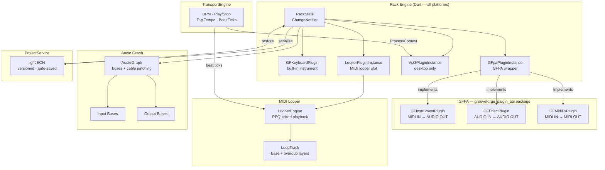
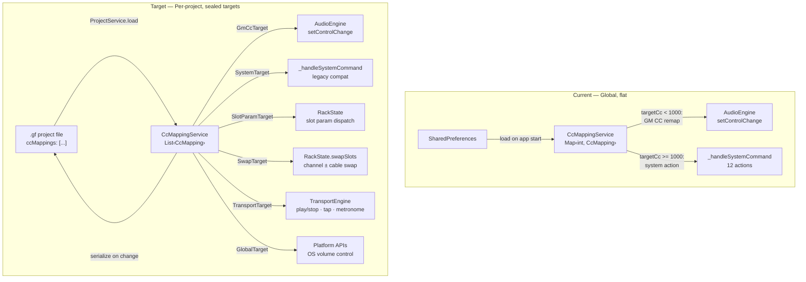
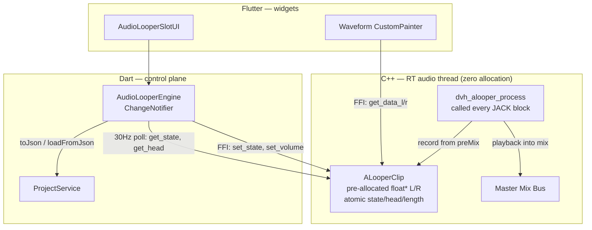
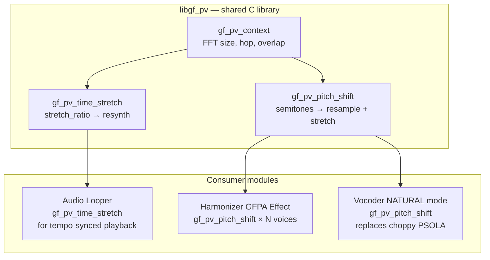
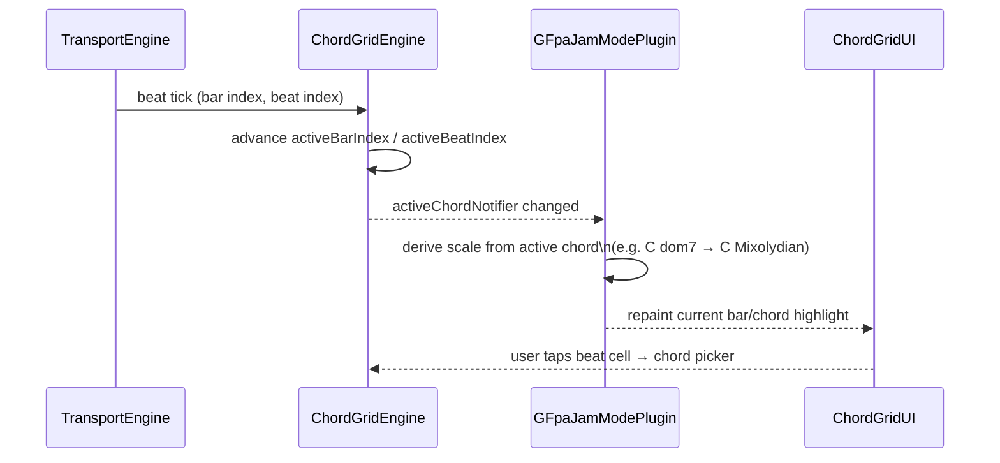

# GrooveForge Roadmap

> **Current released version:** 2.10.0
> **Next milestone:** 🔜 Audio Looper (PCM)
> **Previous:** ✅ Per-project CC mappings (complete)
> **Last updated:** 2026-04-08

---

## 📋 At a Glance

| Version | Phase | Status | Description |
|---|---|---|---|
| 2.0.0 | Phase 1 | ✅ Complete | Rack UI + built-in plugin + .gf project files |
| 2.1.0 | Phase 2 | ✅ Complete | External VST3 hosting (desktop) |
| 2.2.0 | Phase 3 | ✅ Complete | GFPA core + Keyboard / Vocoder / Jam Mode (all platforms) |
| 2.2.1 | Phase 3b | ✅ Complete | Distributable `.vst3` bundles (Linux) |
| 2.3.0 | Phase 4 | ✅ Complete | Transport engine: BPM, play/stop, tap tempo, VST3 ProcessContext |
| 2.4.0 | Phase 5 | ✅ Complete | Audio signal graph + "Back of Rack" cable patching UI |
| 2.5.0 | Phase 6 | ✅ Complete | MIDI Looper (multi-track, overdub, quantization) |
| 2.6.0 | Phase 7 | ✅ Complete | VST3 effect support + insert FX chain |
| 2.7.0 | Phase 8 Tier 1 | ✅ Complete | Six bundled GFPA effects as `.gfpd` + native C++ DSP |
| 2.8.0 | Phase 8 + 10 | ✅ Complete | MIDI FX node system (6 plugins); responsive `.gfpd` UI groups |
| 2.9.0 | Drum Generator | ✅ Complete | New Drum Generator features |
| 2.10.0 | MIDI Looper rework | ✅ Complete | Remove chord detection; simplify engine + UI; bar-sync recording start |
| 2.10.0 | PipeWire migration (Linux) | ✅ Complete | Replace direct ALSA with PipeWire/JACK; inter-app routing; lower latency |
| TBD | Multi-USB audio (Android) | ✅ Complete | Device routing via `setDeviceId()`; built-in mic + USB output as reliable multi-device path |
| **TBD** | **Per-project CC mappings** | **✅ Complete** | Slot-addressed CC control, per-project storage, effect bypass, channel-swap macro, transport/volume CC |
| TBD | Audio Looper (PCM) | **🔜 In progress** | C++ core + Dart engine done; serialisation + UI remaining |
| TBD | Phase Vocoder DSP Library | 🔜 After Audio Looper | Shared time-stretch + pitch-shift engine; enables looper tempo sync, harmonizer effect, vocoder NATURAL fix |
| TBD | Audio Harmonizer | ⏸ After Phase Vocoder | Real-time pitch-shifted harmony voices using the shared phase vocoder |
| TBD | Phase 8 (full) | ⏸ TBD | pub.dev publishing; plugin store; vocoder mk2 |
| TBD | Phase 8b | ⏸ TBD | AudioUnit v3 bridge (macOS + iOS) |
| TBD | Phase 8c | ⏸ TBD | AAP bridge (Android) — pending AAP v1.0 |

---

## 🏗️ Architecture Overview

The diagram below shows how GrooveForge's major components relate to each other. Everything runs in Flutter/Dart except the native audio DSP layer and the VST3 host bridge.



---

## 📄 .gf Project Format

`.gf` files are plain JSON, versioned with a `"version"` field, and auto-saved on every meaningful state change. The `"plugins"` array is ordered — the index matches the visual rack slot order. Platform-exclusive slots (VST3, AUv3) carry a `"platform"` annotation so they degrade gracefully to a placeholder on unsupported systems.

### Example 1 — `grooveforge_keyboard` slot

```json
{
  "id": "slot-0",
  "type": "grooveforge_keyboard",
  "midiChannel": 1,
  "state": {
    "soundfontPath": "/path/to/guitar.sf2",
    "bank": 0,
    "patch": 25
  }
}
```

### Example 2 — `gfpa` slot (Jam Mode or Vocoder)

```json
{
  "id": "slot-jam-0",
  "type": "gfpa",
  "pluginId": "com.grooveforge.jammode",
  "midiChannel": 0,
  "masterSlotId": "slot-1",
  "targetSlotIds": ["slot-0"],
  "state": {
    "enabled": false,
    "scaleType": "standard",
    "detectionMode": "chord",
    "bpmLockBeats": 0
  }
}
```

A vocoder slot uses the same `"type": "gfpa"` envelope with `"pluginId": "com.grooveforge.vocoder"` and vocoder-specific `state` keys (`waveform`, `noiseMix`, `envRelease`, etc.).

### Example 3 — `vst3` slot (desktop-only)

```json
{
  "id": "slot-2",
  "type": "vst3",
  "platform": ["linux", "macos", "windows"],
  "path": "/home/user/.vst3/TAL-Reverb.vst3",
  "name": "TAL Reverb IV",
  "midiChannel": 3
}
```

When this file is opened on Android or iOS, `ProjectService` detects the `"platform"` mismatch and inserts a read-only placeholder slot instead of crashing.

---

## 🖥️ Platform Support

| Feature | Linux | macOS | Windows | Android | iOS | Web |
|---|---|---|---|---|---|---|
| GF Keyboard plugin | ✅ | ✅ | ✅ | ✅ | ✅ | ✅ |
| Vocoder plugin | ✅ | ✅ | ✅ | ✅ | ✅ | ✅ |
| Jam Mode plugin | ✅ | ✅ | ✅ | ✅ | ✅ | ✅ |
| External VST3 hosting | ✅ | ✅ | ✅ | ❌ | ❌ | ❌ |
| MIDI Looper | ✅ | ✅ | ✅ | ✅ | ✅ | ⚠️ |
| Drum Generator | ✅ | ✅ | ✅ | ✅ | ✅ | ⚠️ |
| Audio Looper (PCM) | 🔜 | 🔜 | 🔜 | 🔜 | 🔜 | ❌ |
| AUv3 hosting | ❌ | 🔜 | ❌ | ❌ | 🔜 | ❌ |
| AAP hosting | ❌ | ❌ | ❌ | 🔜 | ❌ | ❌ |
| Web MIDI | ❌ | ❌ | ❌ | ❌ | ❌ | 🔜 |

> ⚠️ = partially works (web has MIDI plugin limitations); 🔜 = planned but not yet shipped.

---

## 🔗 Resources

| Resource | URL | Purpose |
|---|---|---|
| VST3 SDK (MIT since v3.8) | https://github.com/steinbergmedia/vst3sdk | Core VST3 standard library |
| VST3 Developer Portal | https://steinbergmedia.github.io/vst3_dev_portal/ | API docs |
| flutter_vst3 toolkit | https://github.com/MelbourneDeveloper/flutter_vst3 | VST3 plugins & host from Dart |
| flutter_midi_engine (future) | https://pub.dev/packages/flutter_midi_engine | SF3 support + web MIDI |
| MuseScore General SF3 | ftp://ftp.osuosl.org/pub/musescore/soundfont/MuseScore_General/MuseScore_General.sf3 | MIT-licensed default soundfont |
| AAP repository | https://github.com/atsushieno/aap-core | Android Audio Plugins (monitor) |

---

## 📋 Backlog — Unscheduled

Tasks that are confirmed desirable but not yet assigned to a version.

### 🖥️ Platform — Web

Web is a first-class target for GrooveForge's reach, enabling users to play and compose without installation. Both items below are blockers before any meaningful web experience can ship.

- [ ] **Web MIDI**: `flutter_midi_command` throws `MissingPluginException` on web. Integrate a web-compatible MIDI library (Web MIDI API).
- [ ] **Web platform checks**: refactor all `Platform.isLinux` / `Platform.isAndroid` calls to use `kIsWeb` from `flutter/foundation.dart` to avoid `Unsupported operation: Platform._operatingSystem` errors on web.

### 🎛️ Audio Engine

The current SF2 stack (`flutter_midi_pro`) lacks SF3 support, web compatibility, and standard MIDI CC handling. Migrating to `flutter_midi_engine` unblocks higher-quality default sounds and the web platform target simultaneously.

- [ ] **Migrate to `flutter_midi_engine`**: replace `flutter_midi_pro` to gain SF3 support, built-in reverb/chorus, 16-channel support, pitch bend, standard CC messages.
- [ ] **MuseScore General SF3**: switch to `MuseScore_General.sf3` (MIT) as the default soundfont once SF3 support lands on all platforms.
- [ ] **Vocoder NATURAL mode — choppy audio**: the current PSOLA implementation in `audio_input.c` produces audible chopping artifacts on the Natural waveform. Migrate to the shared phase vocoder library (`gf_phase_vocoder`) once it is built — see the Phase Vocoder DSP Library milestone.
- [ ] **Android note-on latency**: `playNote()` sends 3 sequential Dart→Java→JNI method-channel calls (pitchBend reset, CC reset, note-on) before any sound. Remove redundant resets or batch into a single platform call.
- [ ] **Android chord stagger**: chord notes are serialized — each finger triggers a separate `playNote()`. Accumulate notes within a microtask frame and batch into a single platform call.
- [ ] **Native transport beat tracking**: the 10ms Dart timer causes up to 10ms jitter on beat detection. Move beat tracking into the native audio callback (JACK/Oboe/CoreAudio) where it's sample-accurate.
- [ ] **Metronome note-off via `Future.delayed`**: inconsistent click length. Send note-off duration to native and count samples instead.
- [ ] **`volatile` on ARM (Android)**: `g_pitchBendFactor`, `g_vocoderCaptureMode`, callback timestamps use `volatile` instead of C11 `_Atomic` — potential torn reads of 64-bit values on 32-bit ARM.
- [ ] **Audio looper source array data race**: `renderSources[]` modified under mutex by Dart thread, read without mutex by JACK callback. Use atomic count or triple-buffer.
- [ ] **Duplicated vocoder DSP**: `data_callback` and `_vocoder_render_block_impl` in `audio_input.c` share ~80 lines of identical code. Factor into a shared function.
- [ ] **ACF pitch detection O(n×m)**: ~400K multiply-adds every 21ms on the audio thread. Consider YIN or downsampled autocorrelation.

### 🎸 Instruments

These instrument-level enhancements extend the live-performance capability of the rack. MIDI OUT for the Theremin and Stylophone turns them into modulation sources that can drive any downstream slot.

- [ ] **MIDI out for Theremin + Stylophone**: add MIDI OUT jack so these instruments can drive keyboard/VST slots; add a "mute own sound" option.

### 🎼 Jam / Chord Progression

See the dedicated [Chord Progression](#-chord-progression-module) section below for the full design, motivation, and step-by-step breakdown.

- [ ] **Chord progression module**: grid of bars where each bar can hold one or more chords (one per beat, to support jazz/blues grids); synced with the transport (current beat advances the active chord); integrated with the Jam module so the active chord automatically locks the scale.

### 🎹 MIDI Looper — Enhancements

Deferred from Phase 6 and reassessed after the looper rework (Step 4). These build on the simplified engine and bar-strip UI.

- [ ] **Volume slider per track**: multiply velocity by a 0–100 % scale factor in `_fireEventsInRange`; add a `volumeScale` field to `LoopTrack` (persisted in `.gf`); expose via a compact slider in `_TrackRow`.
- [ ] **Long-press STOP → confirm-clear dialog**: replace the current one-tap CLEAR button with a long-press gesture on STOP that shows a confirmation `AlertDialog`, preventing accidental loop erasure during performance.
- [ ] **Humanize jitter**: add an optional random offset (0–50 ms, configurable per track) applied after quantize in `_applyQuantization`; stored as `humanizeMs` on `LoopTrack`.
- [ ] **`looperJumpToBar` CC action**: add a `jumpToBar` variant to `LooperAction` that maps CC value 0–127 to bar index; reset `recordingStartBeat` phase so playback jumps to the target bar on the next tick.
- [ ] **CC Mapping integration**: surface per-slot `LooperSession.ccAssignments` in the global `cc_preferences.dart` screen so users can manage looper CC bindings alongside other mappings.
- [ ] **Two looper slots simultaneously — no timing drift**: verify that two looper slots sharing the same `TransportEngine` clock stay phase-locked over 5+ minutes of continuous playback; add a regression test if drift is found.

### 📊 Project Overview Panel

A read-only dashboard showing the current project's structure at a glance: every loaded module with its MIDI channel, audio/MIDI connections to other modules (and link type — audio cable, Jam follower, CC mapping), and a compact routing diagram. Useful for complex racks where scrolling through individual slot cards is tedious.

- [ ] **Project overview panel**: modal or side-panel showing all loaded modules, their MIDI channels, inter-module links (audio cables, Jam follower relationships, CC mappings per slot), and a compact routing summary.

### 📦 VST3 Bundles (Phase 3b — incomplete items)

These tasks complete the distributable `.vst3` bundle story started in Phase 3b. They are prerequisites for listing GrooveForge plugins in DAW plugin managers on macOS and Windows.

- [ ] Bundle default soundfont in `Resources/` of the keyboard `.vst3` bundle.
- [ ] `make vst-macos` → universal binary build.
- [ ] `make vst-windows` → Win32 build.
- [ ] GitHub Actions CI: build VST3 bundles on Ubuntu/macOS/Windows, upload as release artifacts.
- [ ] Load keyboard in Reaper (Linux) — MIDI note on/off, bank/program, state save/restore.
- [ ] Load vocoder in Reaper (Linux) — sidechain audio input, carrier oscillator modes.
- [ ] Save/restore plugin state in DAW project.

---

## 🎙️ TBD — Multi-USB Audio Device Routing (Android)

Android's default USB audio HAL binds to a single USB audio device per direction (input/output). When a user plugs a USB hub with both a jack output (for an amp/speakers) and a USB-C microphone, the system typically only activates one of them. This is an Android audio policy limitation, not a USB protocol issue.

### Background

- **Android ≤ 13**: the USB audio HAL selects one USB audio device per role; no app-level override.
- **Android 14+**: `AAudioStreamBuilder_setDeviceId()` allows targeting a specific `AudioDeviceInfo` by ID — but only if the HAL still enumerates the device. In practice, plugging a second USB audio device causes the HAL to deactivate the first, so `setDeviceId()` cannot reach it.
- **Combined audio routing** (Android 12+ / extended in 14): `setPreferredDevicesForStrategy()` supports multi-device routing but is a **privileged/system API** — unavailable to regular apps. Even with it, Android 14 only allows simultaneous routing for USB devices of **different audio types**, and requires kernel + vendor support.
- **OEM variability**: device enumeration through a USB hub is inconsistent across manufacturers. Samsung (tested) deactivates the second USB audio device entirely at the HAL level — it disappears from `AudioManager.getDevices()`.

### Reliable alternatives

| Approach | Reliability | Notes |
|---|---|---|
| USB composite audio device (single USB device exposing both input + output interfaces) | ✅ High | HAL sees one device; best option if user hardware supports it |
| Built-in mic + USB jack output | ✅ High | Android handles mixed built-in + USB routing well |
| Two separate USB devices on a hub + `setDeviceId()` | ⚠️ Variable | Works on some OEMs (Android 14+), fails on others |

### 🎙️ Step 1 — Investigation & proof of concept

- [x] **Enumerate USB audio devices**: add a debug screen that calls `AudioManager.getDevices(GET_DEVICES_OUTPUTS | GET_DEVICES_INPUTS)` and lists all `AudioDeviceInfo` entries with their `type`, `id`, and `productName`. Test with a USB hub + two audio devices on 3+ Android devices from different OEMs.
- [x] **AAudio multi-device PoC**: ~~open two separate AAudio streams via Oboe~~ — **blocked by HAL**: Android's USB audio policy deactivates the second USB audio device entirely when a dock headset is plugged in. `setDeviceId()` cannot target a device Android has already removed from enumeration. See compatibility matrix below.
- [x] **Measure latency**: N/A — multi-device routing is not possible with two separate USB audio devices on Samsung Galaxy Z Fold 6. Single-device and built-in mic + USB output paths work at existing latency levels.
- [x] **Document OEM compatibility matrix**: tested on Samsung Galaxy Z Fold 6 (Android 15, One UI 7). See matrix below.

### 📊 OEM compatibility matrix (2026-04-06)

> **Test device**: Samsung Galaxy Z Fold 6 (SM-F956B), Android 15, One UI 7
> **USB dock**: generic USB-C dock with 3.5 mm jack output (chip: CS202)
> **USB mic**: BOYA Mini 2 (USB-C, input only)

| Scenario | Devices enumerated | Result |
|---|---|---|
| BOYA mic only (USB-C) | BOYA Mini 2 (id=302, card=2, input) | ✅ Works |
| Dock + headset only (jack) | CS202 (id=293, card=3, output) + CS202 (id=298, card=3, input) | ✅ Works — composite device, both I/O on same chip |
| BOYA mic + dock headset (both plugged simultaneously) | CS202 only — **BOYA disappears from enumeration** | ❌ **Android HAL drops the BOYA entirely** |
| Built-in mic + dock headset | Built-in mic + CS202 (output) | ✅ Works — mixed built-in + USB routing |

**Conclusion**: Android's USB audio HAL on Samsung (and likely most OEMs) only activates **one USB audio device** at a time. When the dock's CS202 chip activates, the BOYA is deactivated at the HAL level — it is not just deprioritized, it is **removed from `AudioManager.getDevices()` entirely**. `setDeviceId()` is therefore useless for the two-separate-USB-devices scenario.

### 🎙️ Step 2 — Revised scope: single-device routing + built-in mic fallback

Given the HAL limitation, the multi-USB feature pivots to:
1. **Letting the user choose which USB device to use** when multiple are available (before one gets deactivated).
2. **Built-in mic + USB output** as the reliable multi-device path (already works).
3. **Synth output device routing** via `setDeviceId()` on the AAudio stream (already implemented).

- [x] **Device selector UI**: the existing `_MicDeviceDropdown` and `_OutputDeviceDropdown` in `audio_settings_bar.dart` already provide independent input/output device selection with "Default" fallback. Evaluated — sufficient as-is, no dedicated page needed.
- [x] **Oboe stream builder changes**: `oboe_stream_set_output_device()` passes `setDeviceId()` to the AAudio stream builder; the vocoder/miniaudio path already supports `g_androidDeviceId` / `g_androidOutputDeviceId`.
- [x] **Fallback behavior**: `_resetDisconnectedDevices()` resets to system default when a device disappears; `toastNotifier` surfaces a snackbar. AAudio `errorCallback` reopens the stream on the default device via a detached thread.
- [x] **Minimum API level gate**: output device dropdown hidden when `androidSdkVersion < 28` (fetched once during init via method channel). AAudio `setDeviceId()` is only reliable from API 28+; on older versions OpenSL ES silently ignores it.

### 🎙️ Step 3 — l10n

- [x] Add EN/FR keys: existing keys (`audioSettingsBarMicDevice`, `audioSettingsBarOutputDevice`, `micSelectionDefault`, `audioOutputDefault`) already cover input/output/default labels. Added `audioDeviceDisconnectedInput`, `audioDeviceDisconnectedOutput` and 16 `usbAudioDebug*` keys for the debug screen.

### 🧪 Step 4 — Testing

- [x] Single USB audio device → works as before, no regression.
- [x] Unplug USB device mid-session → graceful fallback to system default, no crash.
- [x] USB composite device (single device with both I/O, e.g. dock with jack headset) → works without needing multi-device routing.
- [x] Built-in mic + USB output → both streams active, audio plays through USB while built-in mic captures.
- [x] USB hub + jack output + USB mic on Samsung → **FAIL**: Android HAL deactivates the second USB device.
- [x] Android < 28 → device selector hidden.

---

## 🎛️ TBD — Per-Project CC Mappings 🔜 Next

GrooveForge's CC mapping system is currently limited: ~12 system actions (next/prev soundfont, looper start/stop, mute, jam toggle), standard GM CC remapping, and global storage in SharedPreferences. This milestone transforms CC mappings into a comprehensive, per-project, slot-addressed control surface.

### Why this matters

- **Live performance**: a guitarist's pedalboard CC layout for a blues set is different from a synth-heavy electronic set. Switching projects should switch the entire CC map.
- **Collaboration**: sharing a `.gf` file includes the hardware mapping, so a collaborator with the same controller model gets the same experience.
- **Deep module control**: bypass effects on the fly, sweep a wah center frequency, cycle arpeggiator patterns, change vocoder waveforms — all from hardware CC without touching the screen.
- **Channel-swap macro**: one CC press swaps two instruments' MIDI channels (and optionally their entire signal chains), enabling instant live instrument switching.
- **System integration**: control transport (play/stop, tap tempo, metronome) and OS media volume directly from hardware.

### Architecture — current vs. target



### New data model — sealed `CcMappingTarget` hierarchy

The current `CcMapping.targetCc` field is overloaded (GM CCs 0-127, system actions 1001+). The new model uses a sealed class hierarchy with six target types:

```dart
class CcMapping {
  final int incomingCc;           // Hardware CC 0-127
  final CcMappingTarget target;   // Sealed — one of six types
}

sealed class CcMappingTarget { toJson(); fromJson(); }

class GmCcTarget       { targetCc, targetChannel }           // Standard GM remap
class SystemTarget     { actionCode, targetChannel, muteChannels? } // Legacy 1001-1014
class SlotParamTarget  { slotId, paramKey, mode }             // Slot-addressed param
class SwapTarget       { slotIdA, slotIdB, swapCables }       // Channel-swap macro
class TransportTarget  { action: playStop|tapTempo|metronomeToggle }
class GlobalTarget     { action: systemVolume }               // OS-level controls
```

**Multiple mappings per CC**: one hardware knob can control multiple targets (e.g. CC 20 → reverb mix + delay mix). Storage changes from `Map<int, CcMapping>` to `List<CcMapping>` with a pre-built `Map<int, List<CcMapping>>` index.

#### `.gf` JSON schema

```json
{
  "ccMappings": [
    { "cc": 20, "target": { "type": "slotParam", "slotId": "slot-3", "paramKey": "mix", "mode": "absolute" } },
    { "cc": 64, "target": { "type": "slotParam", "slotId": "slot-3", "paramKey": "bypass", "mode": "toggle" } },
    { "cc": 30, "target": { "type": "swap", "slotIdA": "slot-0", "slotIdB": "slot-1", "swapCables": true } },
    { "cc": 31, "target": { "type": "transport", "action": "playStop" } },
    { "cc": 7,  "target": { "type": "global", "action": "systemVolume" } }
  ]
}
```

### Curated parameter registry

Static Dart registry (`CcParamRegistry`) — not embedded in `.gfpd` descriptors. Declares which parameters per plugin type are CC-controllable.

| Plugin type | paramKey | GFPA paramId | Mode | Notes |
|---|---|---|---|---|
| **All audio effects** | `bypass` | — | toggle | `state['__bypass']` |
| **Reverb** | `mix` | 3 | absolute | |
| **Delay** | `mix` | 4 | absolute | |
| **Delay** | `time` | 0 | absolute | |
| **Delay** | `bpm_sync` | 2 | toggle | |
| **Compressor** | `threshold` | 0 | absolute | |
| **Chorus** | `mix` | 6 | absolute | |
| **Chorus** | `rate` | 0 | absolute | |
| **Wah** | `center` | 0 | absolute | |
| **Wah** | `depth` | 3 | absolute | |
| **All MIDI FX** | `bypass` | — | toggle | `state['__bypass']` |
| **Arpeggiator** | `pattern` | 0 | cycle | 6 options |
| **Arpeggiator** | `division` | 1 | cycle | 9 options |
| **Chord Expand** | `chord_type` | 0 | cycle | 11 options |
| **Transposer** | `semitones` | 0 | absolute | |
| **Velocity Curve** | `amount` | 1 | absolute | |
| **Jam Mode** | `scale_type` | 0 | cycle | 14 options |
| **Jam Mode** | `detection_mode` | 1 | cycle | 2 options |
| **GF Keyboard** | `next_patch` | — | cycle | `_changePatchIndex` |
| **GF Keyboard** | `prev_patch` | — | cycle | |
| **GF Keyboard** | `next_soundfont` | — | cycle | `_cycleChannelSoundfont` |
| **GF Keyboard** | `prev_soundfont` | — | cycle | |
| **Vocoder** | `waveform` | 0 | cycle | 4 (saw/square/choral/neutral) |
| **Vocoder** | `noise_mix` | — | absolute | `vocoderNoiseMix` notifier |

### Channel-swap algorithm

`RackState.swapSlots(String slotIdA, String slotIdB, {bool swapCables = true})`:

**Always** (channels-only):
1. Validate both slots exist and are instrument-type (`midiChannel > 0`)
2. Swap MIDI channels: `pluginA.midiChannel ↔ pluginB.midiChannel`
3. Re-apply `_applyPluginToEngine()` for both (re-routes FluidSynth)
4. Re-sync `_syncJamFollowerMapToEngine()` (Jam entries reference channels)
5. Re-sync `VstHostService.syncAudioRouting()`

**Additionally when `swapCables == true`:**
6. Rewire `AudioGraph`: `swapSlotReferences(slotIdA, slotIdB)` — bulk rewrite all connections
7. Swap Jam Mode slot references (`masterSlotId`, `targetSlotIds`)
8. Update CC mappings: any `SlotParamTarget` referencing either slot gets swapped

### System volume control

| Platform | API | Notes |
|---|---|---|
| Android | `AudioManager.setStreamVolume(STREAM_MUSIC, …)` | Method channel in `MainActivity.kt` |
| Linux | `pactl set-sink-volume @DEFAULT_SINK@ X%` | `Process.run` |
| macOS | `osascript -e "set volume output volume X"` | `Process.run` |
| iOS | Not possible (Apple restriction) | Toast explaining limitation |
| Web | `AudioContext.destination.gain` | App audio only |

### CC preferences UI — hierarchical target picker

```
[Category]          → [Slot]              → [Parameter]
├─ Standard GM CC   → (channel picker)     → CC number
├─ Instruments      → GF Keyboard 1        → Next Patch / Prev Patch / Next SF / …
│                   → Vocoder              → Waveform / Noise Mix
├─ Audio Effects    → Reverb (slot-3)      → Bypass / Mix
│                   → Delay (slot-4)       → Bypass / Mix / Time / BPM Sync
├─ MIDI FX          → Arpeggiator (slot-5) → Bypass / Pattern / Division
│                   → Jam Mode (slot-6)    → Bypass / Scale Type / Detection
├─ Looper           → (existing actions)
├─ Transport        → Play/Stop / Tap Tempo / Metronome Toggle
├─ Global           → System Volume
└─ Macros           → Swap: [slot A] ↔ [slot B] (checkbox: swap cables?)
```

---

### 🎛️ Phase A — Foundation (model + project storage)

- [x] Implement sealed `CcMappingTarget` hierarchy (`GmCcTarget`, `SystemTarget`, `SlotParamTarget`, `SwapTarget`, `TransportTarget`, `GlobalTarget`) with JSON serialization in `cc_mapping_service.dart`.
- [x] Change `CcMappingService` storage from `Map<int, CcMapping>` to `List<CcMapping>` with pre-built `Map<int, List<CcMapping>>` index for O(1) lookup.
- [x] Implement `CcMappingService.toJson()` and `CcMappingService.loadFromJson(List<dynamic>)`.
- [x] Remove `SharedPreferences` persistence from `CcMappingService` (`_prefsKey`, `_persist()`, `_loadMappings()`).
- [x] Wire `ccMappings` into `ProjectService.save` / `_readGfFile` alongside existing `plugins` and `audioGraph` keys.
- [x] Backward compatibility: if `ccMappings` absent in `.gf`, migrate from SharedPreferences on first save, then delete the prefs key.
- [x] On app start with no project, `CcMappingService` starts with empty mapping set.

### 🎛️ Phase B — Audio effect bypass

- [x] Add `state['__bypass']` support to GFPA audio effect slots in `RackState` — `toggleEffectBypass()` and `setEffectBypass()` methods push state to native DSP via `VstHostService.setGfpaDspBypass()`.
- [x] Wire bypass into the audio render path: `GfpaDspInstance::insertCb()` checks `std::atomic<bool> bypassed` (relaxed load, zero CPU cost) and copies input→output unchanged when bypassed. `gfpa_dsp_set_bypass()` C API added to `gfpa_dsp.h/.cpp`. Shared by Android and desktop — both platforms call the same `insertCb`.
- [x] Add bypass UI toggle button on audio effect slot cards — reuses `_BypassHeader` widget from MIDI FX. CC assign button hidden for now (deferred to Phase C/D). `_onParamChanged()` preserves `__bypass` meta-key across DSP state writes.
- [x] Persist bypass state in `.gf` via existing `GFpaPluginInstance.state` serialization. `_syncBypassStatesToNative()` re-applies bypass states after every routing rebuild.

### 🎛️ Phase C — Registry + slot-addressed dispatch

- [x] Create `CcParamRegistry` static registry with curated parameters per plugin type — 26 params across 14 plugin types in `cc_param_registry.dart`. Lookup by plugin ID + param key.
- [x] Expand CC dispatch in `AudioEngine._dispatchCcMapping` — all six sealed target types route to typed callbacks (`onSlotParamCc`, `onSwapSlots`, `onTransportCc`, `onGlobalCc`). Already done in Phase A.
- [x] Add `onSlotParamCc` callback → `RackState.handleSlotParamCc()` — full dispatch with debounced toggle/cycle (250ms), absolute normalized mapping, and special handlers for keyboard (next/prev patch/soundfont) and vocoder (waveform cycle, noise mix).
- [x] Implement absolute mode: denormalizes CC 0-127 via `GFDescriptorPlugin.descriptor.parameters` min/max and pushes to native DSP via `VstHostService.setGfpaDspParam()`.
- [x] Implement toggle mode: fires on CC > 63 with 250ms debounce; routes to `toggleEffectBypass` or `toggleMidiFxBypass` as appropriate.
- [x] Implement cycle mode: reads current normalized value, computes index, advances modulo cycle count, pushes to native DSP.
- [x] Implement `TransportTarget` dispatch: `onTransportCc` callback wired in `RackScreen` — play/stop toggle, `tapTempo()`, metronome toggle. Fires on CC > 63.
- [x] Implement `GlobalTarget.systemVolume`: `AudioEngine.setSystemVolume()` with Android method channel (`AudioManager.setStreamVolume`), Linux `pactl`, macOS `osascript`. iOS/Web no-op.
- [x] Orphan cleanup: `removeOrphanedSlotMappings()` called from `RackState.removePlugin()` — already done in Phase A.

### 🎛️ Phase D — UI overhaul

- [x] Replace flat target dropdown in `cc_preferences.dart` with hierarchical 3-step picker: Category → Slot → Parameter. Supports all 8 categories (GM CC, Instruments, Audio Effects, MIDI FX, Looper, Transport, Global, Macros) with slot+param sub-pickers.
- [x] Display multiple mappings per CC — list view shows all mappings with type-specific icons and display names.
- [x] Add swap macro configuration UI: pick two instrument slots + "swap cables" checkbox.
- [x] Mark project dirty when CC mappings are modified (`RackState.markDirty()` on add/remove).
- [x] Add per-module CC assign button on every rack slot card — `SlotCcAssignDialog` lists all CC-controllable params per slot with learn mode (move a knob → assign) and delete. Icon in slot header bar lights blue when mappings exist. Works on keyboards, vocoder, all effects, all MIDI FX.
### 🎛️ Phase E — Channel-swap macro

- [x] Add `AudioGraph.swapSlotReferences(String slotIdA, String slotIdB)` — atomic bulk rewrite of all connections referencing either slot.
- [x] Implement `RackState.swapSlots(slotIdA, slotIdB, {swapCables})` — channels-only or channels+cables mode (see algorithm above). Also added `CcMappingService.swapSlotReferences()` for CC mapping consistency.
- [x] Wire `SwapTarget` dispatch in `AudioEngine` via `onSwapSlots` callback — gate at CC > 63 in `_dispatchCcMapping`, wired in `RackScreen.initState`.
- [x] Debounce swap toggle (250ms `Timer` in `_RackScreenState`) to prevent rapid double-swap.
- [x] Toast notification on swap: `'Swapped: Keyboard 1 ↔ Vocoder'` via `AudioEngine.toastNotifier`.

### 🎛️ Phase F — l10n + polish

- [x] Add EN/FR ARB keys for all new UI strings: target category names, parameter names, swap labels, system volume, transport actions. 30+ keys in `app_en.arb` / `app_fr.arb`. All hardcoded strings in `cc_preferences.dart` replaced with `AppLocalizations` calls.
- [x] Toast notifications for swap events (`toastSwapped`), system volume changes (`toastSystemVolume`), and bypass toggles (`toggleEffectBypass` / `toggleMidiFxBypass` in `RackState`).

### 🧪 Phase G — Testing

- [x] Create project A with CC 20 → reverb mix (slot-3). Create project B with CC 20 → delay time (slot-4). Switch → verify CC 20 behaviour changes.
- [x] Load old `.gf` without `ccMappings` → verify migration from SharedPreferences on first save.
- [x] Map CC 21 → bypass toggle on reverb slot → press hardware button → verify effect bypassed and UI updates.
- [x] Map CC 7 → system volume → turn knob → verify OS media volume changes (Android, Linux, macOS).
- [x] Map CC 31 → play/stop → press → transport toggles.
- [x] Map CC 30 → swap(keyboard, vocoder, swapCables=true) → press → verify channels + cables swap. Press again → swap back.
- [x] Map CC 30 → swap(keyboard, vocoder, swapCables=false) → press → verify only channels swap, cables stay.
- [x] Delete a slot that has CC mappings → verify orphaned mappings are cleaned up.
- [x] Map one CC to two targets (e.g. CC 20 → reverb mix + delay mix) → turn knob → both parameters move.

---

## 🔊 TBD — Audio Looper (PCM) 🔜 Next

> Builds on the simplified MIDI looper. Adds PCM recording alongside or instead of MIDI.

The Audio Looper extends the looper slot concept from MIDI events to raw PCM audio. This lets users layer live audio (vocals, guitar, synth output) the same way they layer MIDI — arm, record on the next downbeat, overdub, reverse. It also enables a hardware-style workflow where the entire rack output can be captured into a loop clip, not just MIDI note data.

### Architecture — triple-layer design



**Recording tap point**: `preMixL/R` snapshot taken BEFORE looper playback injection → prevents overdub feedback.

**Bar-sync**: C++ callback detects downbeat crossing at sample precision using transport BPM/timeSig atomics (broadcast from `dvh_set_transport`).

**Serialisation**: PCM data as sidecar `.wav` files alongside `.gf` JSON. Metadata (volume, reversed, target length) in JSON.

### 🔊 Phase 1 — C++ core (RT-safe native layer)

- [x] `audio_looper.h` — `ALooperClip` struct, `ALooperState` enum, 14-function C API (`dvh_alooper_create/destroy/set_state/get_state/set_volume/set_reversed/set_source/set_length_beats/get_data_l/get_data_r/get_length/get_capacity/get_head/memory_used`).
- [x] `audio_looper.cpp` — clip lifecycle (pre-allocated `float*` L/R, max 60s × 48kHz ≈ 22MB per clip, pool of 8), RT process function covering all 5 states (idle/armed/recording/playing/overdubbing).
- [x] Bar-sync detection in `dvh_alooper_process`: scans block for exact downbeat sample, transitions armed→recording at that frame.
- [x] Recording auto-stop: when `targetLengthBeats > 0`, recording→playing transition fires at the computed frame count.
- [x] Overdub: single-pass read-add-write (old buffer → output, new input summed → write back), no data race by construction (single-threaded RT callback).
- [x] JACK callback integration: `preMixL/R` snapshot + `dvh_alooper_process` call injected between master mix accumulation and soft-clip in `_jackProcessCallback`.
- [x] Transport broadcast: `dvh_jack_update_transport()` pushes BPM/timeSig/positionInBeats atomics from `dvh_set_transport()` to all JACK `AudioState` instances.
- [x] Non-Linux stubs for all 14 C API functions + transport broadcast.

### 🔊 Phase 2 — Dart FFI bindings + engine

- [x] 14 FFI bindings in `bindings.dart` (`alooperCreate`, `alooperDestroy`, `alooperSetState`, etc.) following the existing `lookupFunction` pattern.
- [x] 14 high-level wrapper methods on `VstHost` in `host.dart` (`createAudioLooperClip`, `setAudioLooperState`, `getAudioLooperDataL`, etc.).
- [x] `AudioLooperEngine` (`ChangeNotifier`) in `lib/services/audio_looper_engine.dart` — clip creation/destruction, state transitions (arm/stop/play/overdub/clear), volume/reverse control, 30Hz native state polling, `toJson`/`loadFromJson`, `onDataChanged` callback, `memoryUsedBytes` getter.
- [x] `AudioLooperClip` model — wraps native clip index, exposes `durationSeconds`, `progress`, serialisation.
- [x] `VstHostService.host` public getter exposed for the looper engine.

### 🔊 Phase 3 — Serialisation (sidecar WAV)

- [x] `wav_utils.dart` — `writeWavFile()`: writes 32-bit float stereo WAV from native `Pointer<Float>` L/R + length. Standard WAV header (44 bytes) + interleaved data chunk.
- [x] `wav_utils.dart` — `readWavFile()`: reads 32-bit float stereo WAV, returns deinterleaved `Float32List` pair + sample rate. Validates RIFF/WAVE/fmt/data chunks.
- [x] `dvh_alooper_load_data()` C API + FFI binding: copies Dart-side `Float32List` into native clip buffers for WAV import.
- [x] `.gf.audio/` directory management in `ProjectService`: `_audioDir()` creates sidecar directory, `_exportAudioLooperWavs()` writes clips as `loop_{slotId}.wav`, cleans up orphan WAVs from deleted clips.
- [x] `ProjectService._writeGfFile` extended: calls `_exportAudioLooperWavs()` after JSON write.
- [x] `ProjectService._readGfFile` extended: calls `_importAudioLooperWavs()` after restoring JSON metadata — allocates native memory, copies WAV data into clip buffers via `loadAudioLooperData()`.
- [x] `audioLooperSessions` key in `.gf` JSON — clip metadata (label, volume, reversed, targetLengthBeats, sampleRate).
- [x] `AudioLooperEngine` registered as `ChangeNotifierProxyProvider` in `main.dart`.
- [x] `ProjectService.audioLooperEngine` reference set in `splash_screen.dart` (same pattern as `ccMappingService`).
- [x] Autosave hook: `AudioLooperEngine.onDataChanged` wired to `ProjectService.autosave` in `splash_screen.dart`.

### 🔊 Phase 4 — UI

- [x] `AudioLooperPluginInstance` model with `type: 'audio_looper'` JSON serialisation, registered in `PluginInstance.fromJson`.
- [x] `AudioLooperSlotUI` widget — rack card with dark hardware-style design, waveform display, transport strip, volume row, status chip.
- [x] Waveform preview: `_WaveformPainter` (`CustomPainter`) draws RMS envelope from native `float*` via FFI (decimated to ~300 bins), playback head line, recording progress indicator.
- [x] Clip controls: Arm/Record, Play/Stop, Overdub, Clear, Reverse toggle — all routed through `AudioLooperEngine`.
- [x] Registered in `add_plugin_sheet.dart` as "Audio Looper" with red accent icon, EN/FR l10n keys.
- [x] Registered in `rack_slot_widget.dart` — `_buildBody` switch + `_shouldShowNoteGlow` exclusion.
- [ ] Source bus selector: pick which audio bus to capture (Master mix, or specific slot output).
- [x] Progress indicator: playback head position rendered as white vertical line on waveform.
- [x] Memory usage indicator: clip memory shown in the volume row as compact label (KB/MB).

### 🔊 Phase 5 — Polish

- [ ] Latency compensation: measure round-trip latency via `jack_port_get_latency_range()`, shift `writeHead` back by that amount.
- [ ] Memory cap: warn if total clip memory exceeds 256 MB (configurable in preferences).
- [ ] l10n: EN/FR ARB keys for all audio looper UI strings.

### 🖥️ Phase 6 — Multi-platform (Android + macOS)

The audio looper is currently Linux-only (JACK callback). It must be ported to:

| Platform | Audio backend | Integration point |
|----------|--------------|-------------------|
| **Android** | Oboe/AAudio | Integrate `dvh_alooper_process()` into the Oboe render callback or create a standalone Oboe stream |
| **macOS** | CoreAudio/miniaudio | Integrate into `dart_vst_host_audio_mac.cpp` callback (same pattern as Linux JACK) |

- [ ] Android: create Oboe audio stream that calls `dvh_alooper_process()` each buffer callback.
- [ ] Android: wire `AudioLooperEngine` to the Oboe-based looper (replace null `host` path).
- [ ] Android: per-clip source routing via Oboe bus renders (keyboard slot render functions).
- [ ] macOS: integrate `dvh_alooper_process()` into `dart_vst_host_audio_mac.cpp` `dataCallback`.
- [ ] macOS: per-clip source routing via CoreAudio render captures.
- [ ] All platforms: ensure WAV sidecar persistence works on Android/macOS file paths.

### 🧪 Phase 7 — Testing

- [ ] Record 4 bars of keyboard output → seamless loop playback.
- [ ] Overdub adds audio without gaps or feedback.
- [ ] Reverse plays clip backwards correctly.
- [ ] Memory warning appears when clips exceed threshold.
- [ ] Save/load project → clips preserved as sidecar WAV files.
- [ ] Delete a clip → WAV file cleaned up on next save.
- [ ] Android: record + playback with bar-sync (Oboe backend).
- [ ] macOS: record + playback with bar-sync (CoreAudio backend).

---

## 🎛️ TBD — Phase Vocoder DSP Library 🔜 After Audio Looper

> A shared, allocation-free C library for high-quality time-stretching and pitch-shifting of arbitrary audio. Enables three downstream features: audio looper tempo sync, real-time harmonizer effect, and a fix for the vocoder's choppy NATURAL mode.

### Why a shared library

The current codebase has PSOLA in the vocoder (`audio_input.c`) for monophonic voice pitch correction, but it produces choppy artifacts on the NATURAL waveform and cannot time-stretch. A proper **phase vocoder** (FFT analysis → modify magnitudes/phases → IFFT resynthesis) handles:

- **Time-stretching** (change speed, preserve pitch) — needed for audio looper tempo sync
- **Pitch-shifting** (change pitch, preserve speed) — needed for the harmonizer
- **Both** on polyphonic audio (not just monophonic voice)

### Architecture



### Tasks

- [ ] `native_audio/gf_phase_vocoder.h` — C API: `gf_pv_create`, `gf_pv_destroy`, `gf_pv_time_stretch`, `gf_pv_pitch_shift`, `gf_pv_process_block`.
- [ ] `native_audio/gf_phase_vocoder.c` — FFT-based phase vocoder (STFT analysis, phase accumulation, overlap-add resynthesis). Pre-allocated FFT buffers (no RT allocation). Configurable FFT size (1024–4096), hop size, window function.
- [ ] Audio looper integration: `dvh_alooper_process` PLAYING state uses `gf_pv_time_stretch` when BPM differs from `recordBpm`, producing tempo-synced playback without pitch change.
- [ ] Vocoder NATURAL mode migration: replace PSOLA grain capture/playback in `audio_input.c` with `gf_pv_pitch_shift` for smoother, artifact-free pitch correction.
- [ ] Dart FFI bindings for standalone use (future harmonizer).
- [ ] Smoke test: time-stretch a 4-bar loop from 120→140 BPM — verify no pitch change, clean transients.

---

## 🎵 TBD — Audio Harmonizer (GFPA Effect)

> Real-time pitch-shifted harmony voices using the shared phase vocoder library. Takes audio in, produces N parallel pitch-shifted copies at configurable intervals (3rd, 5th, octave, etc.), mixed with the dry signal.

### Depends on

- Phase Vocoder DSP Library (above)
- GFPA effect plugin architecture (already exists)

### Tasks

- [ ] `com.grooveforge.harmonizer` GFPA effect plugin — audio in → N pitch-shifted voices → audio out.
- [ ] Parameters: voice count (1–4), interval per voice (semitones, ±24), mix per voice, dry/wet.
- [ ] Integration with Jam Mode: when scale-locked, snap harmony intervals to the active scale.
- [ ] `.gfpd` descriptor file with parameter layout.
- [ ] l10n: EN/FR ARB keys.
- [ ] Smoke test: play a melody through the harmonizer → verify clean parallel harmonies.

---

## 📦 TBD — Phase 8 Full (pub.dev + Plugin Store)

Publishing `grooveforge_plugin_api` to pub.dev makes the GFPA an open ecosystem: any Dart developer can write and distribute GFPA instruments and effects as regular pub packages. The Plugin Store browser then closes the loop by letting users discover community plugins from inside the app.

### 📦 8.1 — Publish `grooveforge_plugin_api` to pub.dev

- [ ] Prepare `packages/grooveforge_plugin_api/` for publication: `CHANGELOG.md`, `example/`, license headers.
- [ ] Add `GFAnalyzerPlugin` interface (audio → visual data stream, no audio output).
- [ ] Run `dart pub publish --dry-run` — fix any issues.
- [ ] Tag v1.0.0 and publish.

### 📦 8.2 — First-Party Plugins (remaining)

| Asset | Type | Description | Status |
|---|---|---|---|
| `com.grooveforge.vocoder_mk2` | Effect | Improved vocoder (see design notes below) | [ ] pending |

**Vocoder Mk2 design** — improvements in priority order:
1. Unvoiced/voiced detection + noise path — detect unvoiced phonemes (/s/, /t/, /f/) via ZCR + autocorrelation; crossfade carrier/noise. Biggest single intelligibility win.
2. LPC analysis mode (~12 poles, Levinson-Durbin) — extracts vocal formants directly; more natural than fixed bands.
3. Formant shift (±N semitones on LPC poles) — changes vocal character without pitch shift.
4. Asymmetric envelope followers — per-band fast attack (~1 ms) / configurable release (30–80 ms).

### 📦 8.3 — Plugin Store Browser (in-app)

- [ ] Add "Plugin Store" modal accessible from `AddPluginSheet`.
- [ ] Query pub.dev search API for packages with keyword `grooveforge_plugin`.
- [ ] Show plugin name, author, version, description, type chip (Instrument / Effect / MIDI FX).
- [ ] "Install" button: display the `pubspec.yaml` entry the user must add and rebuild (informational — dynamic Dart compilation not possible yet).

### 📦 8.4 — Localization

- [ ] Add EN/FR keys: `gfpaPluginStore`, `gfpaPluginInstall`, `gfpaPluginNotInstalled`, `gfpaAnalyzer`.

### 🧪 8.5 — Testing

- [ ] `grooveforge_plugin_api` published to pub.dev — third-party dev can implement `GFEffectPlugin` against it.
- [ ] Plugin Store browser lists pub.dev packages with keyword `grooveforge_plugin`.
- [ ] Unknown `pluginId` in `.gf` file → "Plugin not installed" placeholder, no crash.
- [ ] `GFAnalyzerPlugin` slot renders spectrum data without producing audio output.

### 🧪 Smoke Tests (pending from earlier phases)

- [ ] Manual smoke test Phase 1: Linux.
- [ ] Manual smoke test Phase 1: Android.
- [ ] Phase 2.6 — Save project as `.gf`, reload — verify VST3 parameters restored.
- [ ] Phase 2.6 — Open same `.gf` on Android — verify placeholder shown, no crash.
- [ ] Phase 7.5 — Load a compressor VST3 effect (e.g. LSP Compressor) — verify detected as effect.
- [ ] Phase 7.5 — Insert compressor after Surge XT — audio passes through, effect audible.
- [ ] Phase 7.5 — Reorder effects in insert chain — verify processing order reflected.
- [ ] Phase 7.5 — Save/load project — effect slots and connections restored.
- [ ] Phase 10.2 — Medium layout: `TabBar` + `TabBarView` per group (phone landscape).
- [ ] Phase 10.3 — Validate layout at phone portrait (360×800), phone landscape (800×360), tablet portrait (768×1024), desktop (1280+).
- [ ] Phase 10.4 — Verify `Vst3SlotUI` category chips + modal usable on phone portrait.

---

## 🖥️ TBD — Phase 8b: AudioUnit v3 (macOS + iOS)

AUv3 is the mandatory plugin format for iOS (App Store rules prohibit bundling arbitrary DSP code outside of AUv3 containers) and the standard for GarageBand and Logic Pro integration on macOS. Shipping an AUv3 host unlocks the entire macOS/iOS third-party instrument and effect ecosystem for GrooveForge users without requiring desktop-side VST3 bridges.

### 🖥️ 8b.1 — AuHostService (Dart)

- [ ] `lib/services/au_host_service_stub.dart` — no-op stub for non-Apple platforms.
- [ ] `lib/services/au_host_service_apple.dart` — method channel: `initialize`, `scanPlugins`, `loadPlugin`, `unloadPlugin`, `noteOn/Off`, `getParameters`, `setParameter`, `startAudio`, `stopAudio`.
- [ ] `lib/services/au_host_service.dart` — conditional export (`Platform.isMacOS || Platform.isIOS`).
- [ ] `AuPluginInfo` model — `name`, `manufacturer`, `componentType`, `componentSubType`, `manufacturerCode`, `version`.

### 🖥️ 8b.2 — Native AuHostPlugin (Objective-C++ / Swift)

- [ ] `ios/Classes/AuHostPlugin.swift` + `macos/Classes/AuHostPlugin.swift` (shared logic, platform-specific audio session).
- [ ] `scanPlugins` — `AVAudioUnitComponentManager`, filter to `kAudioUnitType_MusicDevice` + `kAudioUnitType_Effect`.
- [ ] `loadPlugin` — `AVAudioUnit.instantiate`, connect to `AVAudioEngine` main mixer.
- [ ] `setParameter` — `AUParameterTree` lookup + `AUParameter.setValue`.
- [ ] `getParameters` — serialize `AUParameterTree` to `{id, name, min, max, value, unitName}`.
- [ ] `noteOn/Off` — `AUMIDIEventList` via `AUAudioUnit.scheduleMIDIEventBlock`.
- [ ] Transport — `AUAudioUnit.transportStateBlock` wired to `TransportEngine`.
- [ ] iOS audio session: `AVAudioSession.setCategory(.playback, .mixWithOthers)` + interruption handling.

### 🖥️ 8b.3 — AUv3 Slot UI

- [ ] `AuSlotUI` — category chips from `AUParameterGroup`s, `RotaryKnob` grid, "Show Plugin UI" button.
- [ ] "Show Plugin UI" — `AUViewControllerBase`; iOS: modal sheet; macOS: floating window.
- [ ] `AddPluginSheet` gains "AudioUnit" browse option on Apple platforms.

### 🖥️ 8b.4 — `.gf` Format

- [ ] AUv3 slot type `"type": "auv3"` with `componentType`, `componentSubType`, `manufacturer`, `auPreset`.
- [ ] On non-Apple load: show platform-incompatible placeholder, no crash.
- [ ] `AUAudioUnit.fullState` (NSDictionary) serialized to JSON for full state round-trip.

### 🧪 8b.5 — Testing

- [ ] macOS: scan finds installed AUv3 plugins (GarageBand instruments etc.).
- [ ] Load AUSampler or Moog Model D — play notes — audio via CoreAudio.
- [ ] Load built-in AU effect (AUReverb2, AUDelay) — insert after instrument — wet signal audible.
- [ ] "Show Plugin UI" opens native AUv3 view in floating window.
- [ ] iOS: scan finds AUv3 instruments — load one — audio via speaker/headphones.
- [ ] Save/load project: `fullState` round-trips, plugin restored after reload.
- [ ] Open AUv3 `.gf` on Linux → placeholder, no crash.

---

## 🖥️ Phase 8c — AAP Bridge (Android) ⏸ Deferred

Android Audio Plugins (AAP) are the emerging open standard for third-party audio plugins on Android, analogous to VST3 on desktop. GrooveForge defers this work until the ecosystem matures enough to justify the Binder IPC complexity — the four conditions below define "mature enough."

Revisit when **all** conditions are met:

- [ ] AAP reaches v1.0.0 with a stability commitment.
- [ ] At least 10 high-quality instrument/effect plugins available as AAP APKs.
- [ ] A `flutter_aap_host` package exists on pub.dev.
- [ ] Binder IPC round-trip latency < 5 ms on a mid-range Android device.

See [AAP repository](https://github.com/atsushieno/aap-core) for current status.

---

## 🎼 Chord Progression Module

A chord progression module lets users define a looping grid of bars, each bar holding one or more chords (one per beat — enabling jazz and blues ii-V-I grids, 12-bar blues, and similar patterns). The grid is synced to the transport: as playback advances beat by beat, the "active chord" changes. The Jam module reads the active chord to automatically derive and lock the scale — so all instruments snap to the right notes without manual intervention. This makes chord-locked live performance accessible without deep music theory knowledge.

### Component interaction



### 🎼 Step 1 — Data model

- [ ] **Chord progression module**: grid of bars where each bar can hold one or more chords (one per beat, to support jazz/blues grids); synced with the transport (current beat advances the active chord); integrated with the Jam module so the active chord automatically locks the scale.
- [ ] `ChordGrid` — ordered `List<ChordBar>`, max bar count configurable, JSON `toJson`/`fromJson`.
- [ ] `ChordBar` — ordered `List<ChordBeat>` (length = time signature numerator), `toJson`/`fromJson`.
- [ ] `ChordBeat` — `int rootNote` (MIDI pitch class 0–11) + `ChordQuality quality` (maj / min / dom7 / min7 / maj7 / dim / aug).
- [ ] JSON round-trip in `.gf` format: `"type": "chordGrid"` top-level key alongside `"plugins"`.
- [ ] l10n keys for chord quality names: `chordQualityMaj`, `chordQualityMin`, `chordQualityDom7`, `chordQualityMin7`, `chordQualityMaj7`, `chordQualityDim`, `chordQualityAug` (EN + FR).

### 🎼 Step 2 — Engine

- [ ] `ChordGridEngine` (`ChangeNotifier`) — holds a `ChordGrid` and an `activeChordNotifier` (`ValueNotifier<ChordBeat?>`).
- [ ] Subscribes to `TransportEngine` beat ticks; on each tick advances `activeBarIndex` / `activeBeatIndex` modulo grid length.
- [ ] Exposes `ChordBeat? get activeChord` — null when transport is stopped or grid is empty.
- [ ] Thread-safe write: beat ticks arrive from the audio thread; use atomic index updates, no lock on the hot path.

### 🎼 Step 3 — Jam integration

- [ ] `GFpaJamModePlugin` gains an optional `ChordGridEngine? chordGrid` reference.
- [ ] When `chordGrid` is set, derive the current scale from `activeChord` (e.g. C dom7 → C Mixolydian; A min → A Natural Minor) instead of using its manual scale setting.
- [ ] Auto-updates via `activeChordNotifier.addListener` — propagated as an atomic write to the scale state, never via `async`/`await`.
- [ ] When `chordGrid` is null or transport is stopped, fall back to the manually selected scale.

### 🎼 Step 4 — UI

- [ ] `ChordGridWidget` — horizontal scrollable bar grid; each bar displays its beats as cells.
- [ ] Tapping a beat cell opens a chord picker: root note wheel (C → B) + quality selector (chips or dropdown).
- [ ] Current beat cell highlighted in sync with transport (driven by `activeChordNotifier`).
- [ ] Responsive: desktop shows full grid inline; phone portrait collapses to a compact horizontal strip with a "Edit grid" sheet.

### 🧪 Step 5 — Smoke tests

- [ ] Enter a 12-bar blues grid (I7 / IV7 / V7 pattern) → play → verify active chord advances bar by bar.
- [ ] Verify Jam Mode scale updates on each chord change (e.g. C7 → C Mixolydian; F7 → F Mixolydian).
- [ ] Verify keyboard notes snap to correct scale on each chord change.
- [ ] Save/load project → grid restored exactly; no extra `ChordBeat` or missing bars.

---

## ✅ Completed Phases (for reference)

| Phase | Version | Summary |
|---|---|---|
| Phase 1 | 2.0.0 | Rack UI, GrooveForgeKeyboard plugin, .gf project files |
| Phase 2 | 2.1.0 | VST3 hosting (Linux/macOS/Windows), ALSA audio, X11 editor window |
| Phase 3 | 2.2.0 | GFPA interfaces, Keyboard/Vocoder/JamMode as GFPA plugins |
| Phase 3b | 2.2.1 | Distributable Keyboard + Vocoder `.vst3` bundles |
| Phase 4 | 2.3.0 | TransportEngine: BPM, tap tempo, ProcessContext to VST3, Jam Mode BPM lock |
| Phase 5 | 2.4.0 | AudioGraph, "Back of Rack" patch view, bezier cables, Virtual Piano slot |
| Phase 6 | 2.5.0 | MIDI Looper: multi-track, overdub, quantization, CC assignments, pinned slots |
| Phase 7 | 2.6.0 | VST3 effect slots, Vst3EffectSlotUI, insert FX chain shortcut |
| Phase 8 Tier 1 | 2.7.0 | Six `.gfpd` effects (reverb, delay, EQ, compressor, chorus, wah) + native C++ DSP |
| Phase 8 + 10 | 2.8.0 | Six MIDI FX plugins; `.gfpd` `groups:`; responsive plugin panels |
| Drum Generator | 2.9.0 | New Drum Generator features and improvements |
| MIDI Looper rework | 2.10.0 | Remove chord detection; simplify engine + UI; bar-sync recording start |
| PipeWire migration | 2.10.0 | Replace ALSA with JACK client API; inter-app routing; sub-10 ms latency on PipeWire |

Full implementation notes for completed phases are preserved in `git log` and the per-version `CHANGELOG.md`.
