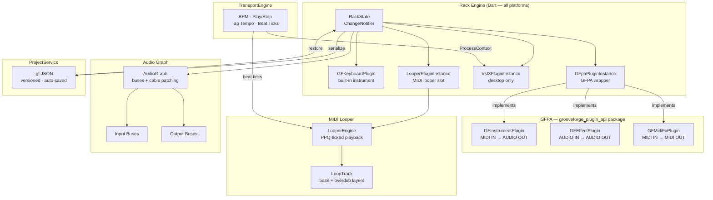
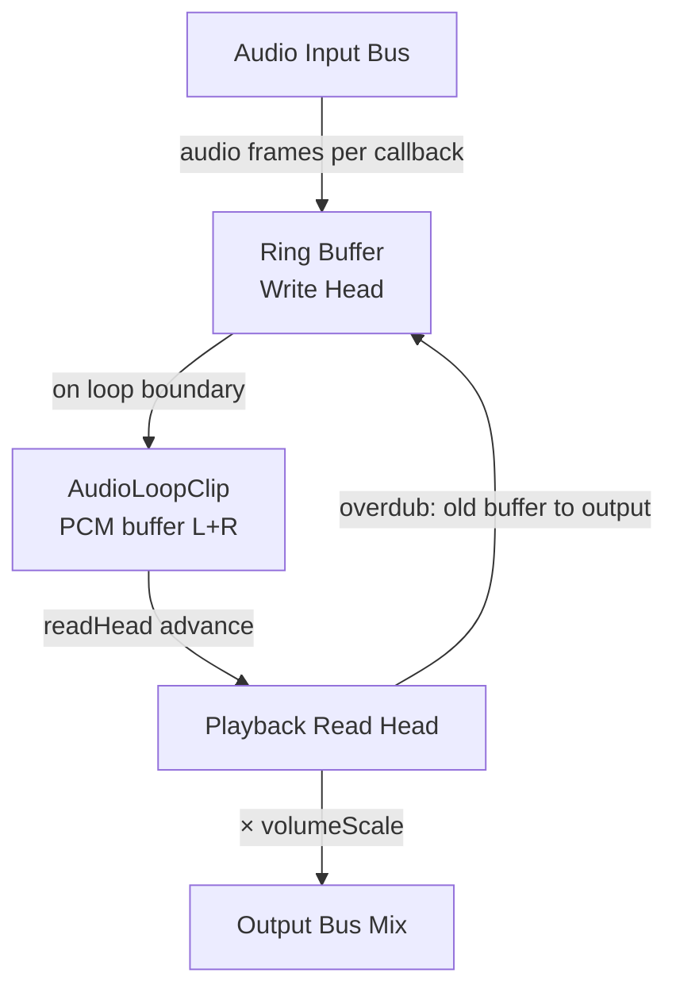
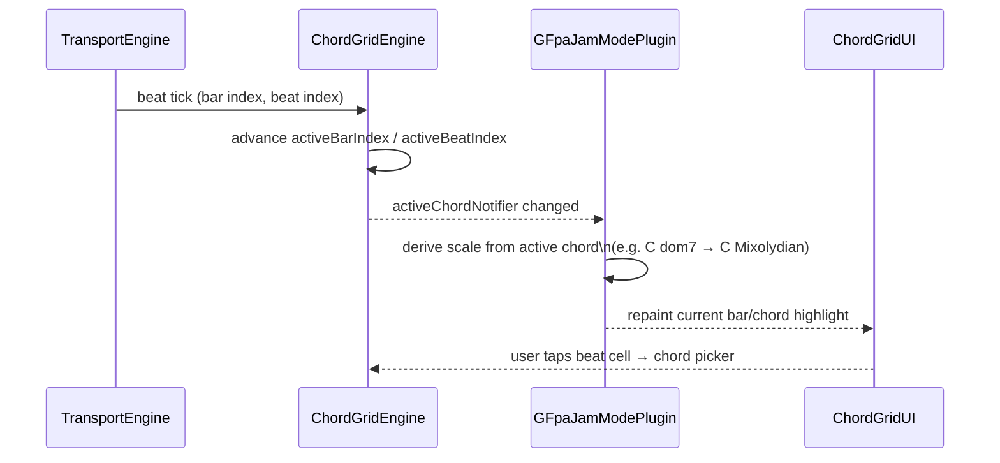

# GrooveForge Roadmap

> **Current released version:** 2.9.0
> **Next milestone:** TBD — MIDI Looper rework (remove chord detection, simplify, then add audio looper)
> **Last updated:** 2026-03-30

---

## 📋 At a Glance

| Version | Phase | Status | Description |
|---|---|---|---|
| 2.0.0 | Phase 1 | ✅ Complete | Rack UI + built-in plugin + .gf project files |
| 2.1.0 | Phase 2 | ✅ Complete | External VST3 hosting (desktop) |
| 2.2.0 | Phase 3 | ✅ Complete | GFPA core + Keyboard / Vocoder / Jam Mode (all platforms) |
| 2.2.1 | Phase 3b | ✅ Complete | Distributable `.vst3` bundles (Linux) |
| 2.3.0 | Phase 4 | ✅ Complete | Transport engine: BPM, play/stop, tap tempo, VST3 ProcessContext |
| 2.4.0 | Phase 5 | ✅ Complete | Audio signal graph + "Back of Rack" cable patching UI |
| 2.5.0 | Phase 6 | ✅ Complete | MIDI Looper (multi-track, overdub, quantization) |
| 2.6.0 | Phase 7 | ✅ Complete | VST3 effect support + insert FX chain |
| 2.7.0 | Phase 8 Tier 1 | ✅ Complete | Six bundled GFPA effects as `.gfpd` + native C++ DSP |
| 2.8.0 | Phase 8 + 10 | ✅ Complete | MIDI FX node system (6 plugins); responsive `.gfpd` UI groups |
| 2.9.0 | Drum Generator | ✅ Complete | New Drum Generator features |
| **TBD** | **MIDI Looper rework** | **🔜 Next** | Remove chord detection; simplify engine + UI; keep bar display |
| TBD | Audio Looper (PCM) | 🔜 Likely after | Built on top of the simplified looper |
| TBD | Phase 8 (full) | ⏸ TBD | pub.dev publishing; plugin store; vocoder mk2 |
| TBD | Phase 8b | ⏸ TBD | AudioUnit v3 bridge (macOS + iOS) |
| TBD | Phase 8c | ⏸ TBD | AAP bridge (Android) — pending AAP v1.0 |

---

## 🏗️ Architecture Overview

The diagram below shows how GrooveForge's major components relate to each other. Everything runs in Flutter/Dart except the native audio DSP layer and the VST3 host bridge.



---

## 📄 .gf Project Format

`.gf` files are plain JSON, versioned with a `"version"` field, and auto-saved on every meaningful state change. The `"plugins"` array is ordered — the index matches the visual rack slot order. Platform-exclusive slots (VST3, AUv3) carry a `"platform"` annotation so they degrade gracefully to a placeholder on unsupported systems.

### Example 1 — `grooveforge_keyboard` slot

```json
{
  "id": "slot-0",
  "type": "grooveforge_keyboard",
  "midiChannel": 1,
  "state": {
    "soundfontPath": "/path/to/guitar.sf2",
    "bank": 0,
    "patch": 25
  }
}
```

### Example 2 — `gfpa` slot (Jam Mode or Vocoder)

```json
{
  "id": "slot-jam-0",
  "type": "gfpa",
  "pluginId": "com.grooveforge.jammode",
  "midiChannel": 0,
  "masterSlotId": "slot-1",
  "targetSlotIds": ["slot-0"],
  "state": {
    "enabled": false,
    "scaleType": "standard",
    "detectionMode": "chord",
    "bpmLockBeats": 0
  }
}
```

A vocoder slot uses the same `"type": "gfpa"` envelope with `"pluginId": "com.grooveforge.vocoder"` and vocoder-specific `state` keys (`waveform`, `noiseMix`, `envRelease`, etc.).

### Example 3 — `vst3` slot (desktop-only)

```json
{
  "id": "slot-2",
  "type": "vst3",
  "platform": ["linux", "macos", "windows"],
  "path": "/home/user/.vst3/TAL-Reverb.vst3",
  "name": "TAL Reverb IV",
  "midiChannel": 3
}
```

When this file is opened on Android or iOS, `ProjectService` detects the `"platform"` mismatch and inserts a read-only placeholder slot instead of crashing.

---

## 🖥️ Platform Support

| Feature | Linux | macOS | Windows | Android | iOS | Web |
|---|---|---|---|---|---|---|
| GF Keyboard plugin | ✅ | ✅ | ✅ | ✅ | ✅ | ✅ |
| Vocoder plugin | ✅ | ✅ | ✅ | ✅ | ✅ | ✅ |
| Jam Mode plugin | ✅ | ✅ | ✅ | ✅ | ✅ | ✅ |
| External VST3 hosting | ✅ | ✅ | ✅ | ❌ | ❌ | ❌ |
| MIDI Looper | ✅ | ✅ | ✅ | ✅ | ✅ | ⚠️ |
| Drum Generator | ✅ | ✅ | ✅ | ✅ | ✅ | ⚠️ |
| Audio Looper (PCM) | 🔜 | 🔜 | 🔜 | 🔜 | 🔜 | ❌ |
| AUv3 hosting | ❌ | 🔜 | ❌ | ❌ | 🔜 | ❌ |
| AAP hosting | ❌ | ❌ | ❌ | 🔜 | ❌ | ❌ |
| Web MIDI | ❌ | ❌ | ❌ | ❌ | ❌ | 🔜 |

> ⚠️ = partially works (web has MIDI plugin limitations); 🔜 = planned but not yet shipped.

---

## 🔗 Resources

| Resource | URL | Purpose |
|---|---|---|
| VST3 SDK (MIT since v3.8) | https://github.com/steinbergmedia/vst3sdk | Core VST3 standard library |
| VST3 Developer Portal | https://steinbergmedia.github.io/vst3_dev_portal/ | API docs |
| flutter_vst3 toolkit | https://github.com/MelbourneDeveloper/flutter_vst3 | VST3 plugins & host from Dart |
| flutter_midi_engine (future) | https://pub.dev/packages/flutter_midi_engine | SF3 support + web MIDI |
| MuseScore General SF3 | ftp://ftp.osuosl.org/pub/musescore/soundfont/MuseScore_General/MuseScore_General.sf3 | MIT-licensed default soundfont |
| AAP repository | https://github.com/atsushieno/aap-core | Android Audio Plugins (monitor) |

---

## 📋 Backlog — Unscheduled

Tasks that are confirmed desirable but not yet assigned to a version.

### 🖥️ Platform — Web

Web is a first-class target for GrooveForge's reach, enabling users to play and compose without installation. Both items below are blockers before any meaningful web experience can ship.

- [ ] **Web MIDI**: `flutter_midi_command` throws `MissingPluginException` on web. Integrate a web-compatible MIDI library (Web MIDI API).
- [ ] **Web platform checks**: refactor all `Platform.isLinux` / `Platform.isAndroid` calls to use `kIsWeb` from `flutter/foundation.dart` to avoid `Unsupported operation: Platform._operatingSystem` errors on web.

### 🎛️ Audio Engine

The current SF2 stack (`flutter_midi_pro`) lacks SF3 support, web compatibility, and standard MIDI CC handling. Migrating to `flutter_midi_engine` unblocks higher-quality default sounds and the web platform target simultaneously.

- [ ] **Migrate to `flutter_midi_engine`**: replace `flutter_midi_pro` to gain SF3 support, built-in reverb/chorus, 16-channel support, pitch bend, standard CC messages.
- [ ] **MuseScore General SF3**: switch to `MuseScore_General.sf3` (MIT) as the default soundfont once SF3 support lands on all platforms.

### 🎸 Instruments

These instrument-level enhancements extend the live-performance capability of the rack. MIDI OUT for the Theremin and Stylophone turns them into modulation sources that can drive any downstream slot.

- [ ] **MIDI out for Theremin + Stylophone**: add MIDI OUT jack so these instruments can drive keyboard/VST slots; add a "mute own sound" option.

### 🎼 Jam / Chord Progression

See the dedicated [Chord Progression](#-chord-progression-module) section below for the full design, motivation, and step-by-step breakdown.

- [ ] **Chord progression module**: grid of bars where each bar can hold one or more chords (one per beat, to support jazz/blues grids); synced with the transport (current beat advances the active chord); integrated with the Jam module so the active chord automatically locks the scale.

### 📦 VST3 Bundles (Phase 3b — incomplete items)

These tasks complete the distributable `.vst3` bundle story started in Phase 3b. They are prerequisites for listing GrooveForge plugins in DAW plugin managers on macOS and Windows.

- [ ] Bundle default soundfont in `Resources/` of the keyboard `.vst3` bundle.
- [ ] `make vst-macos` → universal binary build.
- [ ] `make vst-windows` → Win32 build.
- [ ] GitHub Actions CI: build VST3 bundles on Ubuntu/macOS/Windows, upload as release artifacts.
- [ ] Load keyboard in Reaper (Linux) — MIDI note on/off, bank/program, state save/restore.
- [ ] Load vocoder in Reaper (Linux) — sidechain audio input, carrier oscillator modes.
- [ ] Save/restore plugin state in DAW project.

---

## 🎹 Next — MIDI Looper Rework

The current looper stores per-bar chord names (detected via `ChordDetector`) and displays them in a chord grid strip. This adds complexity for marginal benefit — the bar display itself (length, current bar, overdub position) is the genuinely useful part. The goal is to strip chord detection out entirely, simplify the engine and UI down to what matters, then build the audio looper on top of the cleaner foundation.

### ✅ Step 1 — Remove chord detection

- [x] Remove `chordsPerBar` / `chordPerBar` fields from `LoopTrack` model; remove from `toJson`/`fromJson`.
- [x] Remove `_detectBeatCrossings` and `_flushBarChord` from `LooperEngine`.
- [x] Remove `LoopTrack.detectAndStoreChord` and its `ChordDetector` dependency.
- [x] Remove `chordPerBar` from `.gf` save/load in `ProjectService` (keep backward-compat read that silently drops the field).
- [x] Update `LooperSlotUI` chord grid strip: replace chord name labels with plain bar-number cells (bar 1, bar 2, …). Keep: current-bar highlight, overdub-bar indicator, tap-to-set-resume-point.
- [x] Remove any `ChordDetector` import from looper-related files; verify `dart analyze` clean.

### 🎹 Step 2 — Simplify the engine

- [ ] Audit `LooperEngine` for any other dead code revealed by removing chord detection.
- [ ] Simplify `LoopTrack` state machine if any transitions were chord-detection-gated.
- [ ] Confirm `LoopTrack.toJson`/`fromJson` round-trips cleanly with the stripped model.
- [ ] Verify old `.gf` files with `chordsPerBar` still load without error.

### 🎹 Step 3 — UI cleanup

- [ ] Verify bar strip works correctly after removing chord labels: bar count, current-bar highlight, overdub indicator, resume-point tap.
- [x] Remove any chord-grid-related l10n keys that are now dead (`looperNoChord` removed from `app_en.arb` / `app_fr.arb`).
- [x] Run `flutter analyze` — no issues.

### 🎹 Step 4 — Deferred looper features (reassess after rework)

These were deferred during Phase 6. Decide after the rework whether they still make sense.

- [ ] Volume slider per track (0–100% velocity scale).
- [ ] Long-press STOP → confirm-clear dialog (vs. current CLEAR button).
- [ ] Optional "humanize" jitter (0–50 ms random offset after quantize).
- [ ] `looperJumpToBar` CC: map CC value 0–127 to bar index.
- [ ] Integration with global CC Mapping settings screen.
- [ ] Smart sync: tap Play 100 ms after downbeat → starts immediately (not one bar late).
- [ ] Smart sync: tap Play 400 ms after downbeat → waits for next downbeat.
- [ ] GFK → Looper → Jam Mode + GFK2 chain: scale locks follow recorded chord progression.
- [ ] Two looper slots playing simultaneously → no timing drift.

### 🧪 Step 5 — Smoke test

- [ ] Record a 4-bar loop → bar strip shows 4 cells, current bar advances correctly during playback.
- [ ] Overdub → overdubbing bar highlighted correctly.
- [ ] Tap a bar cell → playback resumes from that bar.
- [ ] Save/load project → bar count and loop events restored; no crash on old files with `chordsPerBar`.

---

## 🔊 TBD — Audio Looper (PCM)

> Builds on the simplified MIDI looper. Adds PCM recording alongside or instead of MIDI.

The Audio Looper extends the looper slot concept from MIDI events to raw PCM audio. This lets users layer live audio (vocals, guitar, synth output) the same way they layer MIDI — arm, record on the next downbeat, overdub, reverse. It also enables a hardware-style workflow where the entire rack output can be captured into a loop clip, not just MIDI note data.

### PCM signal flow



### 🔊 Engine

- [ ] `AudioLoopEngine` (`ChangeNotifier`) — manages `List<AudioLoopClip>`.
- [ ] `armClip(clipId)` — allocates `bufferL/R`; waits for next downbeat.
- [ ] Recording: write `frameCount` PCM frames per audio callback into ring buffer.
- [ ] On loop boundary: switch to `playing`, reset `readHead = 0`.
- [ ] Playback: add `buffer[readHead…] × volumeScale` to target bus; advance `readHead`.
- [ ] Overdub: simultaneously read old buffer to output AND write new audio (summed).
- [ ] Latency compensation: measure round-trip latency, shift `writeHead` back by that amount.
- [ ] Memory cap: warn if total clip memory exceeds 256 MB (configurable in preferences).

### 🔊 UI

- [ ] `AudioLoopClipCard` in the Looper Panel (visually distinct from MIDI track cards).
- [ ] Waveform preview: `CustomPainter` draws RMS envelope (decimated to ~300 points).
- [ ] Clip controls: Record, Play/Stop, Overdub, Clear, Mute, Reverse toggle.
- [ ] Source bus selector: pick which audio bus to capture (Main, or specific slot audio out).

### 🧪 Testing

- [ ] Record 4 bars of Surge XT output → seamless loop playback.
- [ ] Overdub adds audio without gaps.
- [ ] Reverse plays clip backwards correctly.
- [ ] Memory warning appears when clips exceed threshold.
- [ ] Save/load project → clips preserved (base64 embedded or sidecar `.pcm`).

---

## 📦 TBD — Phase 8 Full (pub.dev + Plugin Store)

Publishing `grooveforge_plugin_api` to pub.dev makes the GFPA an open ecosystem: any Dart developer can write and distribute GFPA instruments and effects as regular pub packages. The Plugin Store browser then closes the loop by letting users discover community plugins from inside the app.

### 📦 8.1 — Publish `grooveforge_plugin_api` to pub.dev

- [ ] Prepare `packages/grooveforge_plugin_api/` for publication: `CHANGELOG.md`, `example/`, license headers.
- [ ] Add `GFAnalyzerPlugin` interface (audio → visual data stream, no audio output).
- [ ] Run `dart pub publish --dry-run` — fix any issues.
- [ ] Tag v1.0.0 and publish.

### 📦 8.2 — First-Party Plugins (remaining)

| Asset | Type | Description | Status |
|---|---|---|---|
| `com.grooveforge.vocoder_mk2` | Effect | Improved vocoder (see design notes below) | [ ] pending |

**Vocoder Mk2 design** — improvements in priority order:
1. Unvoiced/voiced detection + noise path — detect unvoiced phonemes (/s/, /t/, /f/) via ZCR + autocorrelation; crossfade carrier/noise. Biggest single intelligibility win.
2. LPC analysis mode (~12 poles, Levinson-Durbin) — extracts vocal formants directly; more natural than fixed bands.
3. Formant shift (±N semitones on LPC poles) — changes vocal character without pitch shift.
4. Asymmetric envelope followers — per-band fast attack (~1 ms) / configurable release (30–80 ms).

### 📦 8.3 — Plugin Store Browser (in-app)

- [ ] Add "Plugin Store" modal accessible from `AddPluginSheet`.
- [ ] Query pub.dev search API for packages with keyword `grooveforge_plugin`.
- [ ] Show plugin name, author, version, description, type chip (Instrument / Effect / MIDI FX).
- [ ] "Install" button: display the `pubspec.yaml` entry the user must add and rebuild (informational — dynamic Dart compilation not possible yet).

### 📦 8.4 — Localization

- [ ] Add EN/FR keys: `gfpaPluginStore`, `gfpaPluginInstall`, `gfpaPluginNotInstalled`, `gfpaAnalyzer`.

### 🧪 8.5 — Testing

- [ ] `grooveforge_plugin_api` published to pub.dev — third-party dev can implement `GFEffectPlugin` against it.
- [ ] Plugin Store browser lists pub.dev packages with keyword `grooveforge_plugin`.
- [ ] Unknown `pluginId` in `.gf` file → "Plugin not installed" placeholder, no crash.
- [ ] `GFAnalyzerPlugin` slot renders spectrum data without producing audio output.

### 🧪 Smoke Tests (pending from earlier phases)

- [ ] Manual smoke test Phase 1: Linux.
- [ ] Manual smoke test Phase 1: Android.
- [ ] Phase 2.6 — Save project as `.gf`, reload — verify VST3 parameters restored.
- [ ] Phase 2.6 — Open same `.gf` on Android — verify placeholder shown, no crash.
- [ ] Phase 7.5 — Load a compressor VST3 effect (e.g. LSP Compressor) — verify detected as effect.
- [ ] Phase 7.5 — Insert compressor after Surge XT — audio passes through, effect audible.
- [ ] Phase 7.5 — Reorder effects in insert chain — verify processing order reflected.
- [ ] Phase 7.5 — Save/load project — effect slots and connections restored.
- [ ] Phase 10.2 — Medium layout: `TabBar` + `TabBarView` per group (phone landscape).
- [ ] Phase 10.3 — Validate layout at phone portrait (360×800), phone landscape (800×360), tablet portrait (768×1024), desktop (1280+).
- [ ] Phase 10.4 — Verify `Vst3SlotUI` category chips + modal usable on phone portrait.

---

## 🖥️ TBD — Phase 8b: AudioUnit v3 (macOS + iOS)

AUv3 is the mandatory plugin format for iOS (App Store rules prohibit bundling arbitrary DSP code outside of AUv3 containers) and the standard for GarageBand and Logic Pro integration on macOS. Shipping an AUv3 host unlocks the entire macOS/iOS third-party instrument and effect ecosystem for GrooveForge users without requiring desktop-side VST3 bridges.

### 🖥️ 8b.1 — AuHostService (Dart)

- [ ] `lib/services/au_host_service_stub.dart` — no-op stub for non-Apple platforms.
- [ ] `lib/services/au_host_service_apple.dart` — method channel: `initialize`, `scanPlugins`, `loadPlugin`, `unloadPlugin`, `noteOn/Off`, `getParameters`, `setParameter`, `startAudio`, `stopAudio`.
- [ ] `lib/services/au_host_service.dart` — conditional export (`Platform.isMacOS || Platform.isIOS`).
- [ ] `AuPluginInfo` model — `name`, `manufacturer`, `componentType`, `componentSubType`, `manufacturerCode`, `version`.

### 🖥️ 8b.2 — Native AuHostPlugin (Objective-C++ / Swift)

- [ ] `ios/Classes/AuHostPlugin.swift` + `macos/Classes/AuHostPlugin.swift` (shared logic, platform-specific audio session).
- [ ] `scanPlugins` — `AVAudioUnitComponentManager`, filter to `kAudioUnitType_MusicDevice` + `kAudioUnitType_Effect`.
- [ ] `loadPlugin` — `AVAudioUnit.instantiate`, connect to `AVAudioEngine` main mixer.
- [ ] `setParameter` — `AUParameterTree` lookup + `AUParameter.setValue`.
- [ ] `getParameters` — serialize `AUParameterTree` to `{id, name, min, max, value, unitName}`.
- [ ] `noteOn/Off` — `AUMIDIEventList` via `AUAudioUnit.scheduleMIDIEventBlock`.
- [ ] Transport — `AUAudioUnit.transportStateBlock` wired to `TransportEngine`.
- [ ] iOS audio session: `AVAudioSession.setCategory(.playback, .mixWithOthers)` + interruption handling.

### 🖥️ 8b.3 — AUv3 Slot UI

- [ ] `AuSlotUI` — category chips from `AUParameterGroup`s, `RotaryKnob` grid, "Show Plugin UI" button.
- [ ] "Show Plugin UI" — `AUViewControllerBase`; iOS: modal sheet; macOS: floating window.
- [ ] `AddPluginSheet` gains "AudioUnit" browse option on Apple platforms.

### 🖥️ 8b.4 — `.gf` Format

- [ ] AUv3 slot type `"type": "auv3"` with `componentType`, `componentSubType`, `manufacturer`, `auPreset`.
- [ ] On non-Apple load: show platform-incompatible placeholder, no crash.
- [ ] `AUAudioUnit.fullState` (NSDictionary) serialized to JSON for full state round-trip.

### 🧪 8b.5 — Testing

- [ ] macOS: scan finds installed AUv3 plugins (GarageBand instruments etc.).
- [ ] Load AUSampler or Moog Model D — play notes — audio via CoreAudio.
- [ ] Load built-in AU effect (AUReverb2, AUDelay) — insert after instrument — wet signal audible.
- [ ] "Show Plugin UI" opens native AUv3 view in floating window.
- [ ] iOS: scan finds AUv3 instruments — load one — audio via speaker/headphones.
- [ ] Save/load project: `fullState` round-trips, plugin restored after reload.
- [ ] Open AUv3 `.gf` on Linux → placeholder, no crash.

---

## 🖥️ Phase 8c — AAP Bridge (Android) ⏸ Deferred

Android Audio Plugins (AAP) are the emerging open standard for third-party audio plugins on Android, analogous to VST3 on desktop. GrooveForge defers this work until the ecosystem matures enough to justify the Binder IPC complexity — the four conditions below define "mature enough."

Revisit when **all** conditions are met:

- [ ] AAP reaches v1.0.0 with a stability commitment.
- [ ] At least 10 high-quality instrument/effect plugins available as AAP APKs.
- [ ] A `flutter_aap_host` package exists on pub.dev.
- [ ] Binder IPC round-trip latency < 5 ms on a mid-range Android device.

See [AAP repository](https://github.com/atsushieno/aap-core) for current status.

---

## 🎼 Chord Progression Module

A chord progression module lets users define a looping grid of bars, each bar holding one or more chords (one per beat — enabling jazz and blues ii-V-I grids, 12-bar blues, and similar patterns). The grid is synced to the transport: as playback advances beat by beat, the "active chord" changes. The Jam module reads the active chord to automatically derive and lock the scale — so all instruments snap to the right notes without manual intervention. This makes chord-locked live performance accessible without deep music theory knowledge.

### Component interaction



### 🎼 Step 1 — Data model

- [ ] **Chord progression module**: grid of bars where each bar can hold one or more chords (one per beat, to support jazz/blues grids); synced with the transport (current beat advances the active chord); integrated with the Jam module so the active chord automatically locks the scale.
- [ ] `ChordGrid` — ordered `List<ChordBar>`, max bar count configurable, JSON `toJson`/`fromJson`.
- [ ] `ChordBar` — ordered `List<ChordBeat>` (length = time signature numerator), `toJson`/`fromJson`.
- [ ] `ChordBeat` — `int rootNote` (MIDI pitch class 0–11) + `ChordQuality quality` (maj / min / dom7 / min7 / maj7 / dim / aug).
- [ ] JSON round-trip in `.gf` format: `"type": "chordGrid"` top-level key alongside `"plugins"`.
- [ ] l10n keys for chord quality names: `chordQualityMaj`, `chordQualityMin`, `chordQualityDom7`, `chordQualityMin7`, `chordQualityMaj7`, `chordQualityDim`, `chordQualityAug` (EN + FR).

### 🎼 Step 2 — Engine

- [ ] `ChordGridEngine` (`ChangeNotifier`) — holds a `ChordGrid` and an `activeChordNotifier` (`ValueNotifier<ChordBeat?>`).
- [ ] Subscribes to `TransportEngine` beat ticks; on each tick advances `activeBarIndex` / `activeBeatIndex` modulo grid length.
- [ ] Exposes `ChordBeat? get activeChord` — null when transport is stopped or grid is empty.
- [ ] Thread-safe write: beat ticks arrive from the audio thread; use atomic index updates, no lock on the hot path.

### 🎼 Step 3 — Jam integration

- [ ] `GFpaJamModePlugin` gains an optional `ChordGridEngine? chordGrid` reference.
- [ ] When `chordGrid` is set, derive the current scale from `activeChord` (e.g. C dom7 → C Mixolydian; A min → A Natural Minor) instead of using its manual scale setting.
- [ ] Auto-updates via `activeChordNotifier.addListener` — propagated as an atomic write to the scale state, never via `async`/`await`.
- [ ] When `chordGrid` is null or transport is stopped, fall back to the manually selected scale.

### 🎼 Step 4 — UI

- [ ] `ChordGridWidget` — horizontal scrollable bar grid; each bar displays its beats as cells.
- [ ] Tapping a beat cell opens a chord picker: root note wheel (C → B) + quality selector (chips or dropdown).
- [ ] Current beat cell highlighted in sync with transport (driven by `activeChordNotifier`).
- [ ] Responsive: desktop shows full grid inline; phone portrait collapses to a compact horizontal strip with a "Edit grid" sheet.

### 🧪 Step 5 — Smoke tests

- [ ] Enter a 12-bar blues grid (I7 / IV7 / V7 pattern) → play → verify active chord advances bar by bar.
- [ ] Verify Jam Mode scale updates on each chord change (e.g. C7 → C Mixolydian; F7 → F Mixolydian).
- [ ] Verify keyboard notes snap to correct scale on each chord change.
- [ ] Save/load project → grid restored exactly; no extra `ChordBeat` or missing bars.

---

## ✅ Completed Phases (for reference)

| Phase | Version | Summary |
|---|---|---|
| Phase 1 | 2.0.0 | Rack UI, GrooveForgeKeyboard plugin, .gf project files |
| Phase 2 | 2.1.0 | VST3 hosting (Linux/macOS/Windows), ALSA audio, X11 editor window |
| Phase 3 | 2.2.0 | GFPA interfaces, Keyboard/Vocoder/JamMode as GFPA plugins |
| Phase 3b | 2.2.1 | Distributable Keyboard + Vocoder `.vst3` bundles |
| Phase 4 | 2.3.0 | TransportEngine: BPM, tap tempo, ProcessContext to VST3, Jam Mode BPM lock |
| Phase 5 | 2.4.0 | AudioGraph, "Back of Rack" patch view, bezier cables, Virtual Piano slot |
| Phase 6 | 2.5.0 | MIDI Looper: multi-track, overdub, quantization, CC assignments, pinned slots |
| Phase 7 | 2.6.0 | VST3 effect slots, Vst3EffectSlotUI, insert FX chain shortcut |
| Phase 8 Tier 1 | 2.7.0 | Six `.gfpd` effects (reverb, delay, EQ, compressor, chorus, wah) + native C++ DSP |
| Phase 8 + 10 | 2.8.0 | Six MIDI FX plugins; `.gfpd` `groups:`; responsive plugin panels |
| Drum Generator | 2.9.0 | New Drum Generator features and improvements |

Full implementation notes for completed phases are preserved in `git log` and the per-version `CHANGELOG.md`.
