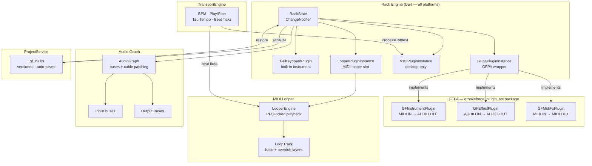
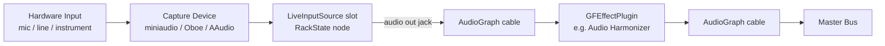
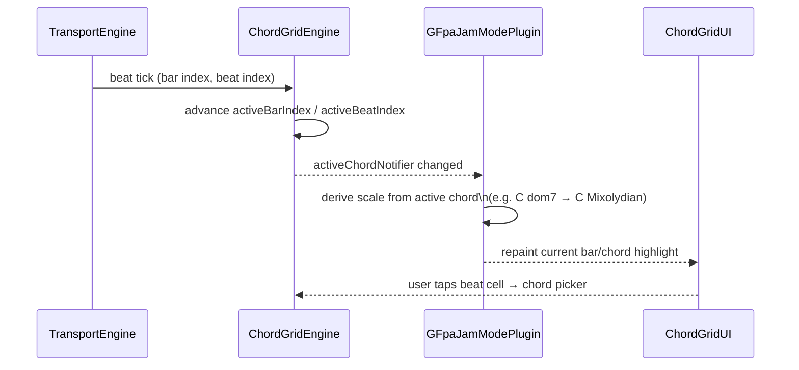

# GrooveForge Roadmap

> **Current released version:** 2.12.7
> **Next milestone:** 🔜 v2.13.0 — Live Audio Input Source
> **Previous:** ✅ Phase Vocoder + Audio Harmonizer (2.12.7)
> **Last updated:** 2026-04-13
>
> Historical design notes and shipped-milestone details have been moved to [ROADMAP_ARCHIVE.md](ROADMAP_ARCHIVE.md) to keep this document focused on pending work.

---

## 📋 At a Glance

| Version | Phase | Status | Description |
|---|---|---|---|
| 2.0.0 – 2.8.0 | Phases 1–8 Tier 1 + MIDI FX | ✅ Complete | See Completed Phases table below |
| 2.9.0 | Drum Generator | ✅ Complete | `.gfdrum` pattern format, 10 bundled grooves, humanization, time-signature sync |
| 2.10.0 | MIDI Looper rework + PipeWire/JACK (Linux) | ✅ Complete | Simplified engine, bar-sync recording, per-track volume; JACK audio backend with inter-app routing |
| 2.11.0 | Multi-USB audio + per-project CC mappings | ✅ Complete | USB device routing (Android), per-project CC storage, channel-swap macro, Linux packaging |
| 2.12.0 | Audio Looper (PCM) | ✅ Complete | C++ RT core, cabled input routing, sidecar WAV persistence, waveform UI |
| 2.12.1 – 2.12.6 | Audio Looper polish + Android MIDI latency | ✅ Complete | CC assign, Android cabled inputs, bar-sync stop padding, Android note-on latency fix |
| 2.12.7 | Phase Vocoder + Audio Harmonizer + NATURAL rewrite | ✅ Complete | Shared FFT time-stretch/pitch-shift library; audio looper tempo sync; 4-voice harmonizer GFPA effect; NATURAL vocoder mode loop-resample rewrite |
| 2.13.0 | Live Audio Input Source | **🔜 Next** | New rack source module that exposes a chosen hardware input (mic / line-in) as an audio output jack, cable-able into any GFPA effect |
| TBD | Phase 8 Full | 🔜 | pub.dev publishing of `grooveforge_plugin_api`, in-app plugin store browser |
| TBD | Phase 8b | ⏸ TBD | AudioUnit v3 bridge (macOS + iOS) |
| TBD | Phase 8c | ⏸ TBD | AAP bridge (Android) — pending AAP v1.0 |
| TBD | Chord Progression Module | ⏸ TBD | Bar-indexed chord grid synced with transport and Jam Mode |

---

## 🏗️ Architecture Overview

The diagram below shows how GrooveForge's major components relate to each other. Everything runs in Flutter/Dart except the native audio DSP layer and the VST3 host bridge.



---

## 📄 .gf Project Format

`.gf` files are plain JSON, versioned with a `"version"` field, and auto-saved on every meaningful state change. The `"plugins"` array is ordered — the index matches the visual rack slot order. Platform-exclusive slots (VST3, AUv3) carry a `"platform"` annotation so they degrade gracefully to a placeholder on unsupported systems.

### Example 1 — `grooveforge_keyboard` slot

```json
{
  "id": "slot-0",
  "type": "grooveforge_keyboard",
  "midiChannel": 1,
  "state": {
    "soundfontPath": "/path/to/guitar.sf2",
    "bank": 0,
    "patch": 25
  }
}
```

### Example 2 — `gfpa` slot (Jam Mode or Vocoder)

```json
{
  "id": "slot-jam-0",
  "type": "gfpa",
  "pluginId": "com.grooveforge.jammode",
  "midiChannel": 0,
  "masterSlotId": "slot-1",
  "targetSlotIds": ["slot-0"],
  "state": {
    "enabled": false,
    "scaleType": "standard",
    "detectionMode": "chord",
    "bpmLockBeats": 0
  }
}
```

A vocoder slot uses the same `"type": "gfpa"` envelope with `"pluginId": "com.grooveforge.vocoder"` and vocoder-specific `state` keys (`waveform`, `noiseMix`, `envRelease`, etc.).

### Example 3 — `vst3` slot (desktop-only)

```json
{
  "id": "slot-2",
  "type": "vst3",
  "platform": ["linux", "macos", "windows"],
  "path": "/home/user/.vst3/TAL-Reverb.vst3",
  "name": "TAL Reverb IV",
  "midiChannel": 3
}
```

When this file is opened on Android or iOS, `ProjectService` detects the `"platform"` mismatch and inserts a read-only placeholder slot instead of crashing.

---

## 🖥️ Platform Support

| Feature | Linux | macOS | Windows | Android | iOS | Web |
|---|---|---|---|---|---|---|
| GF Keyboard plugin | ✅ | ✅ | ✅ | ✅ | ✅ | ✅ |
| Vocoder plugin | ✅ | ✅ | ✅ | ✅ | ✅ | ✅ |
| Jam Mode plugin | ✅ | ✅ | ✅ | ✅ | ✅ | ✅ |
| External VST3 hosting | ✅ | ✅ | ✅ | ❌ | ❌ | ❌ |
| MIDI Looper | ✅ | ✅ | ✅ | ✅ | ✅ | ⚠️ |
| Drum Generator | ✅ | ✅ | ✅ | ✅ | ✅ | ⚠️ |
| Audio Looper (PCM) | ✅ | ✅ | ✅ | ✅ | ✅ | ❌ |
| Audio Looper tempo-sync (phase vocoder) | ✅ | ✅ | ❌ | ✅ | ❌ | ❌ |
| Audio Harmonizer effect | ✅ | ✅ | ❌ | ✅ | ❌ | ❌ |
| AUv3 hosting | ❌ | 🔜 | ❌ | ❌ | 🔜 | ❌ |
| AAP hosting | ❌ | ❌ | ❌ | 🔜 | ❌ | ❌ |
| Web MIDI | ❌ | ❌ | ❌ | ❌ | ❌ | 🔜 |

> ⚠️ = partially works (web has MIDI plugin limitations); 🔜 = planned but not yet shipped.

---

## 🔗 Resources

| Resource | URL | Purpose |
|---|---|---|
| VST3 SDK (MIT since v3.8) | https://github.com/steinbergmedia/vst3sdk | Core VST3 standard library |
| VST3 Developer Portal | https://steinbergmedia.github.io/vst3_dev_portal/ | API docs |
| flutter_vst3 toolkit | https://github.com/MelbourneDeveloper/flutter_vst3 | VST3 plugins & host from Dart |
| flutter_midi_engine (future) | https://pub.dev/packages/flutter_midi_engine | SF3 support + web MIDI |
| MuseScore General SF3 | ftp://ftp.osuosl.org/pub/musescore/soundfont/MuseScore_General/MuseScore_General.sf3 | MIT-licensed default soundfont |
| AAP repository | https://github.com/atsushieno/aap-core | Android Audio Plugins (monitor) |

---

## 📋 Backlog — Unscheduled

Tasks that are confirmed desirable but not yet assigned to a version.

### 🖥️ Platform — Web

Web is a first-class target for GrooveForge's reach, enabling users to play and compose without installation. Both items below are blockers before any meaningful web experience can ship.

- [ ] **Web MIDI**: `flutter_midi_command` throws `MissingPluginException` on web. Integrate a web-compatible MIDI library (Web MIDI API).
- [ ] **Web platform checks**: refactor all `Platform.isLinux` / `Platform.isAndroid` calls to use `kIsWeb` from `flutter/foundation.dart` to avoid `Unsupported operation: Platform._operatingSystem` errors on web.

### 🎛️ Audio Engine

The current SF2 stack (`flutter_midi_pro`) lacks SF3 support, web compatibility, and standard MIDI CC handling. Migrating to `flutter_midi_engine` unblocks higher-quality default sounds and the web platform target simultaneously.

- [ ] **Migrate to `flutter_midi_engine`**: replace `flutter_midi_pro` to gain SF3 support, built-in reverb/chorus, 16-channel support, pitch bend, standard CC messages.
- [ ] **MuseScore General SF3**: switch to `MuseScore_General.sf3` (MIT) as the default soundfont once SF3 support lands on all platforms.
- [ ] **Vocoder NATURAL mode — choppy audio**: the current PSOLA implementation in `audio_input.c` produces audible chopping artifacts on the Natural waveform. Migrate to the shared phase vocoder library (`gf_phase_vocoder`) once it is built — see the Phase Vocoder DSP Library milestone.
- [x] **Android note-on latency**: fixed in v2.12.6. Dropped the two pre-emptive pitchBend / CC resets in `playNote` (Dart-side change — commented with a restore recipe) and rewired `playNote / stopNote / _sendControlChange / _sendPitchBend` to reach new `gf_native_*` FFI exports in `native-lib.cpp` instead of going through the `flutter_midi_pro` method-channel → Kotlin audioExecutor → JNI chain. Per-note latency dropped from ~9 ms to ~0.3 ms, matching the Linux/macOS direct-FFI path through `libaudio_input.so`.
- [x] **Android chord stagger**: fixed by the same v2.12.6 change — every note now reaches `fluid_synth_noteon` synchronously inside the same Dart microtask, so a multi-note chord dispatched across a handful of microseconds of Dart execution is effectively simultaneous. No batching primitive was needed; removing the three-calls-per-note serialisation was enough.
- [ ] **Native transport beat tracking**: the 10ms Dart timer causes up to 10ms jitter on beat detection. Move beat tracking into the native audio callback (JACK/Oboe/CoreAudio) where it's sample-accurate.
- [ ] **Metronome note-off via `Future.delayed`**: inconsistent click length. Send note-off duration to native and count samples instead.
- [ ] **`volatile` on ARM (Android)**: `g_pitchBendFactor`, `g_vocoderCaptureMode`, callback timestamps use `volatile` instead of C11 `_Atomic` — potential torn reads of 64-bit values on 32-bit ARM.
- [ ] **Audio looper source array data race**: `renderSources[]` modified under mutex by Dart thread, read without mutex by JACK callback. Use atomic count or triple-buffer.
- [ ] **Duplicated vocoder DSP**: `data_callback` and `_vocoder_render_block_impl` in `audio_input.c` share ~80 lines of identical code. Factor into a shared function.
- [ ] **ACF pitch detection O(n×m)**: ~400K multiply-adds every 21ms on the audio thread. Consider YIN or downsampled autocorrelation.
- [ ] **VST3 → GFPA effect cable silently dropped (Linux, macOS, Android)**. Cabling `VST3 instrument → com.grooveforge.reverb / harmonizer / wah / …` produces no audio on any platform — the native host has two parallel audio paths (VST3 processing order and `DvhRenderFn` master-render list) and GFPA insert chains are keyed by render function, with no equivalent entry point for a VST3 plugin output bus. The fix requires a new native concept (`addVst3InsertChain`), a mirror on Android, and the shared post-chain capture helper from Phase C of the routing redesign. Tracked as Phase F in [AUDIO_ROUTING_REDESIGN.md](AUDIO_ROUTING_REDESIGN.md) — deliberately deferred until after A.4 + C land so it can reuse the shared capture helper.
- [ ] **Chain-shared effect corrupts audio on divergent topologies (Linux, macOS, Android)**. Cabling `kb1 → reverb`, `kb2 → harmonizer → reverb`, `theremin → harmonizer → reverb` produces crackling on every source and fills logcat with `VERY LATE 98 ms` callback overruns. Root cause is the greedy merge heuristic in `dvh_add_master_insert` (`dart_vst_host_jack.cpp:731–774`): Stage 1 merges the new source into the first existing chain that contains the target effect, producing wrong semantics (bypassed effects) and a double-call of every source render function per audio block (which desynchronises the FluidSynth / miniaudio sample cursor and causes the crackling). Fix requires a new atomic native entry point `dvh_set_master_insert_chain(sources[], effects[])` that commits one chain without merge logic. Tracked as Phase H in [AUDIO_ROUTING_REDESIGN.md](AUDIO_ROUTING_REDESIGN.md), scheduled alongside Phase F. **User workaround**: avoid sharing the same effect across divergent chains — duplicate the effect slot, or make the shared effect a terminal stage that no other source branches around.

### 🎛️ Phase Vocoder — Polish

The phase vocoder DSP library and its first two consumers (audio looper tempo sync, audio harmonizer) shipped in v2.12.7. Detailed history lives in [ROADMAP_ARCHIVE.md](ROADMAP_ARCHIVE.md). Remaining work:

- [ ] **First-block ring-in latency compensation**. The first audio block after entering PLAYING on a stretched looper clip — and the first block of each note played through the harmonizer — has a ~46 ms ring-in fade (Hann+4×-overlap warm-up). Options: pre-feed input samples before the state transition, offset the head start by the ring-in length, or accept as-is. Audible as a very soft fade-in over the first two beats of sustained playback; more noticeable on staccato harmonizer attacks.
- [ ] **Dart FFI bindings for the phase vocoder library** so future consumers (tests, offline rendering tools) can use it without going through an existing effect.

### 🎵 Audio Harmonizer — Polish

The harmonizer GFPA effect shipped in v2.12.7. Detailed history in [ROADMAP_ARCHIVE.md](ROADMAP_ARCHIVE.md). Remaining work:

- [ ] **Jam Mode scale snap**: when the rack has Jam Mode active and scale-locked, the harmonizer's voice intervals should be snapped to the active scale instead of being treated as raw chromatic offsets. Pure Dart wrapper, no DSP changes.

### 🎸 Instruments

These instrument-level enhancements extend the live-performance capability of the rack. MIDI OUT for the Theremin and Stylophone turns them into modulation sources that can drive any downstream slot.

- [ ] **MIDI out for Theremin + Stylophone**: add MIDI OUT jack so these instruments can drive keyboard/VST slots; add a "mute own sound" option.

### 🎼 Jam / Chord Progression

See the dedicated [Chord Progression](#-chord-progression-module) section below for the full design, motivation, and step-by-step breakdown.

- [ ] **Chord progression module**: grid of bars where each bar can hold one or more chords (one per beat, to support jazz/blues grids); synced with the transport (current beat advances the active chord); integrated with the Jam module so the active chord automatically locks the scale.

### 🎹 MIDI Looper — Enhancements

Deferred from Phase 6 and reassessed after the looper rework (Step 4). These build on the simplified engine and bar-strip UI.

- [ ] **Volume slider per track**: multiply velocity by a 0–100 % scale factor in `_fireEventsInRange`; add a `volumeScale` field to `LoopTrack` (persisted in `.gf`); expose via a compact slider in `_TrackRow`.
- [ ] **Long-press STOP → confirm-clear dialog**: replace the current one-tap CLEAR button with a long-press gesture on STOP that shows a confirmation `AlertDialog`, preventing accidental loop erasure during performance.
- [ ] **Humanize jitter**: add an optional random offset (0–50 ms, configurable per track) applied after quantize in `_applyQuantization`; stored as `humanizeMs` on `LoopTrack`.
- [ ] **`looperJumpToBar` CC action**: add a `jumpToBar` variant to `LooperAction` that maps CC value 0–127 to bar index; reset `recordingStartBeat` phase so playback jumps to the target bar on the next tick.
- [ ] **CC Mapping integration**: surface per-slot `LooperSession.ccAssignments` in the global `cc_preferences.dart` screen so users can manage looper CC bindings alongside other mappings.
- [ ] **Two looper slots simultaneously — no timing drift**: verify that two looper slots sharing the same `TransportEngine` clock stay phase-locked over 5+ minutes of continuous playback; add a regression test if drift is found.

### 📊 Project Overview Panel

A read-only dashboard showing the current project's structure at a glance: every loaded module with its MIDI channel, audio/MIDI connections to other modules (and link type — audio cable, Jam follower, CC mapping), and a compact routing diagram. Useful for complex racks where scrolling through individual slot cards is tedious.

- [ ] **Project overview panel**: modal or side-panel showing all loaded modules, their MIDI channels, inter-module links (audio cables, Jam follower relationships, CC mappings per slot), and a compact routing summary.

### 🔊 Audio Looper — Remaining Polish + Multi-platform

Shipped in v2.12.0 (Linux, cabled input routing, WAV persistence). These tasks extend coverage to Android/macOS and add polish features deferred from the initial release.

- [x] **Source bus selector** (partial): `AudioLooperSlotUI` now ships a compact `_SourceSelector` dropdown that lets the user pick any audio-producing slot in the rack and rewrites the audio cables into the looper in one atomic operation (clear existing cables → connect `audioOutL/R → audioInL/R` of the selected source). The current source is derived from the `AudioGraph` every rebuild so there is no duplicated state. **Master mix capture is still deferred** — it requires a new native routing kind (the audio looper clip would need to read the final master mix buffer instead of a per-slot dry buffer), and every backend callback would need a new source-list branch. Tracked separately.
- [ ] **Source bus selector — Master mix**: extend the `_SourceSelector` dropdown with a "Master mix" entry that captures the full post-master-mix buffer. Requires a new `dvh_alooper_set_capture_master` C API, a new clip state field, and matching fill-loop branches in `dart_vst_host_jack.cpp` / `dart_vst_host_audio_mac.cpp` / `oboe_stream_android.cpp`.
- [ ] **Save `.wav` sidecars with every named project save**: the fix in v2.12.5 covers `saveProjectAs` when the picker returns a POSIX-style filesystem path (desktop + some Android vendors), but Android SAF `content://` URIs still can't receive sidecar files. Needs a dedicated in-app project picker rooted under `getApplicationDocumentsDirectory()` so every named save has a real filesystem path and the `loop_{slotId}.wav` export can run unconditionally. Track the follow-up `saveProject(path)` call site in [project_service.dart](lib/services/project_service.dart) too — it already writes sidecars via `_writeGfFile`, but verify named saves on all three desktop backends.
- [ ] **Latency compensation**: measure round-trip latency via `jack_port_get_latency_range()` (Linux) / equivalent on Android/macOS and shift `writeHead` back by that amount so what the user hears during recording matches what gets written into the clip. Needs real-device measurement on each platform.
- [ ] **Transport-synced playback start must actually sync to bars**: when bar-sync is enabled on an audio looper clip, pressing Play on a stopped clip currently starts playback immediately — there is no wait-for-next-bar like recording arm has. Two sub-cases to fix: (a) **transport stopped** → pressing play should *also* start the transport in the same call, so they are phase-locked from frame zero; (b) **transport running** → pressing play should transition the clip through a new `ALOOPER_ARMED_PLAYING` (or reuse `ARMED` with a play-target flag) and defer the head-reset + state store to the next bar boundary detected in `dvh_alooper_process`. Currently the loop starts mid-bar and is completely out of sync. Touches `audio_looper.h` (new state or flag), `audio_looper.cpp` (bar-detect branch in the process loop), and `AudioLooperEngine.play/looperButtonPress` in Dart to pick the right transition. Check whether `recordingStartBeat` / the existing bar-sync arm path can be reused with a play-intent flag instead of duplicating the state machine.
- [x] **Memory cap**: `AudioLooperEngine` now tracks total pool memory against a configurable soft cap (default 256 MB, exposed as `memoryCapBytes`). A toast fires once per session the first time the cap is crossed, and the per-clip memory label in the volume row tints amber at ≥ 75% and red at ≥ 90%. Not a hard cap — recording continues past the threshold on purpose. "Configurable in preferences" is deferred — the field is mutable on the engine but no UI exists yet to edit it at runtime.
- [x] **l10n**: EN/FR ARB keys for all audio looper UI strings — waveform placeholders, transport tooltips, status chip labels all flow through `AppLocalizations` in `audio_looper_slot_ui.dart`.
- [x] **Android**: create Oboe audio stream that calls `dvh_alooper_process()` each buffer callback — shipped in v2.12.0 as part of the initial Android looper work.
- [x] **Android**: wire `AudioLooperEngine` to the Oboe-based looper (replace null `host` path) — also shipped in v2.12.0 via the `AudioInputFFI.alooper*` path.
- [x] **Android**: per-clip source routing via Oboe bus IDs. New `dvh_alooper_add_bus_source` C API + `_syncAudioLooperSourcesAndroid` in `VstHostService` walk each looper's audio cables and push the upstream bus slot IDs (keyboard sfId / drum channel sfId / `kBusSlotTheremin`). The Android audio callback fills each clip's source buffer by matching bus IDs against its snapshot of `g_sources[]`, summing the **dry** pre-FX signal from `g_srcDryL/R[s]` so the looper captures the instrument, not its insert effects.
- [x] **Android**: stylophone → audio looper — migrated onto the shared Oboe bus in `NativeInstrumentController.onStylophoneAdded/Removed` with a new `stylophone_bus_render` trampoline + `stylophoneBusRenderFnAddr` FFI shim. Capture-mode toggling silences the private miniaudio device so there's no double playback. Can now be cabled to the audio looper and into GFPA insert chains exactly like the theremin.
- [x] **Android**: vocoder → audio looper — same migration. New `NativeInstrumentController.onVocoderAdded/Removed` methods flip capture mode + register/unregister `vocoder_bus_render` on Oboe slot 102. The vocoder's mic capture device stays on its existing miniaudio path; only playback moves to the bus.
- [x] **macOS**: integrate `dvh_alooper_process()` into `dart_vst_host_audio_mac.cpp` `dataCallback` — shipped earlier; the render-source path matches Linux.
- [x] **macOS**: VST3 plugin-source routing for audio looper — the macOS fill loop now resolves each clip's plugin-source ordinal to a `void*` handle via `ordered[plugIdx]`, looks it up in the per-callback `bufs` map that `_processPlugins` already fills, and sums the stereo output into the clip's source buffer. Cabling a VST3 plugin to an audio looper now records audio on macOS exactly like on Linux.
- [ ] **macOS**: pre-allocate per-plugin output buffers (separate TODO, tracked at `dart_vst_host_audio_mac.cpp:168`) — the `bufs` map is still allocated fresh every callback. Non-critical for correctness (the looper plugin-source path works) but is a heap-churn hot spot under rapid plugin add/remove and should mirror the Linux triple-buffer snapshot refactor.
- [x] **All platforms**: WAV sidecar persistence. Android now reaches the same `dvh_alooper_*` symbols through `AudioInputFFI` (the `libnative-lib.so` build of `audio_looper.cpp`) that desktop reaches through `libdart_vst_host.so`, and `ProjectService._exportAudioLooperWavs` / `VstHostService.importAudioLooperWavs` branch on `Platform.isAndroid` to pick the right path. macOS uses the desktop path directly — verified.

### 📦 VST3 Bundles (Phase 3b — incomplete items)

These tasks complete the distributable `.vst3` bundle story started in Phase 3b. They are prerequisites for listing GrooveForge plugins in DAW plugin managers on macOS and Windows.

- [ ] Bundle default soundfont in `Resources/` of the keyboard `.vst3` bundle.
- [ ] `make vst-macos` → universal binary build.
- [ ] `make vst-windows` → Win32 build.
- [ ] GitHub Actions CI: build VST3 bundles on Ubuntu/macOS/Windows, upload as release artifacts.
- [ ] Load keyboard in Reaper (Linux) — MIDI note on/off, bank/program, state save/restore.
- [ ] Load vocoder in Reaper (Linux) — sidechain audio input, carrier oscillator modes.
- [ ] Save/restore plugin state in DAW project.

## 🎙️ v2.13.0 — Live Audio Input Source

Today, hardware audio inputs (microphone, line-in, instrument) can only reach effects **indirectly**: the Audio Looper owns the capture path, so wiring a mic into the Audio Harmonizer or Vocoder Mk2 means recording a loop first. Users want to sing or play live and hear the effect in real time — the same way a guitar pedalboard works.

This milestone introduces a dedicated **Live Input source slot** for the rack. It selects a hardware capture device (including a specific channel pair on multi-channel interfaces) and exposes its PCM stream as a standard audio output jack, cable-able into any GFPA effect via the existing `AudioGraph` cable system. No DSP, no recording — it's a pure source node.

### Motivation

- **Live vocal processing**: sing through `com.grooveforge.audio_harmonizer` or the vocoder without going through the looper.
- **Live instrument effects**: guitar / bass / external synth → any effect chain.
- **Multi-input cards**: users with audio interfaces that expose several inputs (line 1/2, XLR, Hi-Z) can pick which pair feeds the rack.
- **Reuses existing plumbing**: capture devices, cabled routing, and GFPA effect slots already exist — this milestone is mostly glue and a new UI slot.

### Data flow



### Platform support

| Platform | Capture backend | Multi-input device enumeration | Status |
|---|---|---|---|
| Linux (PipeWire/JACK) | miniaudio + JACK client | ✅ via `dvh_list_capture_devices` | 🔜 |
| Linux (ALSA fallback) | miniaudio | ✅ | 🔜 |
| macOS | miniaudio (CoreAudio) | ✅ | 🔜 |
| Windows | miniaudio (WASAPI) | ✅ | 🔜 |
| Android | Oboe / AAudio | Partial — USB class-compliant only | 🔜 |
| iOS | AVAudioSession | Single input at a time | ⏸ Phase 8b |

### Step 1 — Engine (Dart + C++)

- [ ] Add `LiveInputSourceEngine` in `lib/services/live_input_source_engine.dart` — thin Dart wrapper around a new `dvh_liveinput_*` FFI surface that mirrors the `dvh_alooper_*` shape (open device, start/stop, push PCM into an audio-graph bus).
- [ ] Add `live_input_source.cpp` in `native/` — allocation-free capture callback that writes interleaved float frames into a lock-free ring buffer, then drains that ring into the assigned `AudioGraph` bus on the render tick. Must respect Rule 2 (no allocation, no locks on the audio thread).
- [ ] Expose `AudioInputFFI.liveInput*` bindings for Android, reusing the existing shared Oboe bus that `NativeInstrumentController` already owns — avoid opening a second capture stream.
- [ ] Reuse `dvh_list_capture_devices` for device enumeration; extend it to report channel count and a per-device list of selectable channel pairs (e.g. `"Focusrite 2i2 — In 1+2"`, `"In 1 (mono)"`, `"In 2 (mono)"`).

### Step 2 — Rack integration

- [ ] New `LiveInputSourcePluginInstance` registered in `RackState` alongside `LooperPluginInstance` and `GFpaPluginInstance`. It has **zero MIDI I/O** and exactly **one stereo audio output jack**.
- [ ] Add slot type `"live_input_source"` to `.gf` JSON schema — persisted fields: `deviceId` (string, matches miniaudio device name), `channelPair` ("1+2" | "1" | "2" | …), `gainDb` (−24…+24), `monitorMute` (bool — mute local monitor to avoid feedback when headphones are not used).
- [ ] Migration: bump `.gf` version and add a no-op migration step for existing projects.
- [ ] `ProjectService._serializePlugin` / `_deserializePlugin` branches for the new slot type.

### Step 3 — UI

- [ ] New `LiveInputSourceSlotUI` widget under `lib/widgets/rack/` — front panel shows: device dropdown, channel-pair dropdown, input level meter (peak + RMS), gain knob, monitor-mute toggle, and a clipping LED.
- [ ] Back panel shows the single audio output jack, wired through the existing cable-drawing layer.
- [ ] Add the slot to `AddPluginSheet` under a new "Sources" category (create the category — currently only Instruments / Effects / MIDI FX exist).
- [ ] Responsive layout per Rule 1: desktop shows meter + knob side-by-side, phone portrait stacks them vertically.

  > Design note: the VU meter reads from a small shared-memory snapshot updated by the capture callback (one atomic float per frame block). No FFI call per frame — the UI polls at 30 Hz via `Ticker`.

### Step 4 — Localization (Rule 4)

- [ ] Add EN keys to `app_en.arb`: `liveInputSource`, `liveInputDeviceLabel`, `liveInputChannelLabel`, `liveInputGainLabel`, `liveInputMonitorMute`, `liveInputNoDevice`, `liveInputClipping`, `sourcesCategory`.
- [ ] Add FR translations to `app_fr.arb` (keep "Live Input" in English if the literal French is awkward — per memory rule).

### 🧪 Smoke test

- [ ] Linux + Focusrite 2i2: add Live Input slot → pick "In 1+2" → cable into Audio Harmonizer → sing → hear 4-voice harmonies in real time with < 20 ms round-trip latency.
- [ ] Linux + built-in mic: add Live Input slot → cable into Vocoder Mk1 (carrier = keyboard slot) → talk while playing chords → hear vocoded output.
- [ ] Save project → close app → reopen → verify device, channel pair, gain, and cable connection all restored.
- [ ] Android + USB interface: Live Input slot picks the USB device; cable into Audio Harmonizer produces audible output without crashing Oboe.
- [ ] Unplug device while slot is active → slot shows "No device" placeholder, no crash, audio thread keeps running.
- [ ] `flutter analyze` → "No issues found" (Rule 6).

---

## 📦 TBD — Phase 8 Full (pub.dev + Plugin Store)

Publishing `grooveforge_plugin_api` to pub.dev makes the GFPA an open ecosystem: any Dart developer can write and distribute GFPA instruments and effects as regular pub packages. The Plugin Store browser then closes the loop by letting users discover community plugins from inside the app.

### 📦 8.1 — Publish `grooveforge_plugin_api` to pub.dev

- [ ] Prepare `packages/grooveforge_plugin_api/` for publication: `CHANGELOG.md`, `example/`, license headers.
- [ ] Add `GFAnalyzerPlugin` interface (audio → visual data stream, no audio output).
- [ ] Run `dart pub publish --dry-run` — fix any issues.
- [ ] Tag v1.0.0 and publish.

### 📦 8.2 — First-Party Plugins (remaining)

| Asset | Type | Description | Status |
|---|---|---|---|
| `com.grooveforge.vocoder_mk2` | Effect | Improved vocoder (see design notes below) | [ ] pending |

**Vocoder Mk2 design** — improvements in priority order:
1. Unvoiced/voiced detection + noise path — detect unvoiced phonemes (/s/, /t/, /f/) via ZCR + autocorrelation; crossfade carrier/noise. Biggest single intelligibility win.
2. LPC analysis mode (~12 poles, Levinson-Durbin) — extracts vocal formants directly; more natural than fixed bands.
3. Formant shift (±N semitones on LPC poles) — changes vocal character without pitch shift.
4. Asymmetric envelope followers — per-band fast attack (~1 ms) / configurable release (30–80 ms).

### 📦 8.3 — Plugin Store Browser (in-app)

- [ ] Add "Plugin Store" modal accessible from `AddPluginSheet`.
- [ ] Query pub.dev search API for packages with keyword `grooveforge_plugin`.
- [ ] Show plugin name, author, version, description, type chip (Instrument / Effect / MIDI FX).
- [ ] "Install" button: display the `pubspec.yaml` entry the user must add and rebuild (informational — dynamic Dart compilation not possible yet).

### 📦 8.4 — Localization

- [ ] Add EN/FR keys: `gfpaPluginStore`, `gfpaPluginInstall`, `gfpaPluginNotInstalled`, `gfpaAnalyzer`.

### 🧪 8.5 — Testing

- [ ] `grooveforge_plugin_api` published to pub.dev — third-party dev can implement `GFEffectPlugin` against it.
- [ ] Plugin Store browser lists pub.dev packages with keyword `grooveforge_plugin`.
- [ ] Unknown `pluginId` in `.gf` file → "Plugin not installed" placeholder, no crash.
- [ ] `GFAnalyzerPlugin` slot renders spectrum data without producing audio output.

### 🧪 Smoke Tests (pending from earlier phases)

- [ ] Manual smoke test Phase 1: Linux.
- [ ] Manual smoke test Phase 1: Android.
- [ ] Phase 2.6 — Save project as `.gf`, reload — verify VST3 parameters restored.
- [ ] Phase 2.6 — Open same `.gf` on Android — verify placeholder shown, no crash.
- [ ] Phase 7.5 — Load a compressor VST3 effect (e.g. LSP Compressor) — verify detected as effect.
- [ ] Phase 7.5 — Insert compressor after Surge XT — audio passes through, effect audible.
- [ ] Phase 7.5 — Reorder effects in insert chain — verify processing order reflected.
- [ ] Phase 7.5 — Save/load project — effect slots and connections restored.
- [ ] Phase 10.2 — Medium layout: `TabBar` + `TabBarView` per group (phone landscape).
- [ ] Phase 10.3 — Validate layout at phone portrait (360×800), phone landscape (800×360), tablet portrait (768×1024), desktop (1280+).
- [ ] Phase 10.4 — Verify `Vst3SlotUI` category chips + modal usable on phone portrait.

---

## 🖥️ TBD — Phase 8b: AudioUnit v3 (macOS + iOS)

AUv3 is the mandatory plugin format for iOS (App Store rules prohibit bundling arbitrary DSP code outside of AUv3 containers) and the standard for GarageBand and Logic Pro integration on macOS. Shipping an AUv3 host unlocks the entire macOS/iOS third-party instrument and effect ecosystem for GrooveForge users without requiring desktop-side VST3 bridges.

### 🖥️ 8b.1 — AuHostService (Dart)

- [ ] `lib/services/au_host_service_stub.dart` — no-op stub for non-Apple platforms.
- [ ] `lib/services/au_host_service_apple.dart` — method channel: `initialize`, `scanPlugins`, `loadPlugin`, `unloadPlugin`, `noteOn/Off`, `getParameters`, `setParameter`, `startAudio`, `stopAudio`.
- [ ] `lib/services/au_host_service.dart` — conditional export (`Platform.isMacOS || Platform.isIOS`).
- [ ] `AuPluginInfo` model — `name`, `manufacturer`, `componentType`, `componentSubType`, `manufacturerCode`, `version`.

### 🖥️ 8b.2 — Native AuHostPlugin (Objective-C++ / Swift)

- [ ] `ios/Classes/AuHostPlugin.swift` + `macos/Classes/AuHostPlugin.swift` (shared logic, platform-specific audio session).
- [ ] `scanPlugins` — `AVAudioUnitComponentManager`, filter to `kAudioUnitType_MusicDevice` + `kAudioUnitType_Effect`.
- [ ] `loadPlugin` — `AVAudioUnit.instantiate`, connect to `AVAudioEngine` main mixer.
- [ ] `setParameter` — `AUParameterTree` lookup + `AUParameter.setValue`.
- [ ] `getParameters` — serialize `AUParameterTree` to `{id, name, min, max, value, unitName}`.
- [ ] `noteOn/Off` — `AUMIDIEventList` via `AUAudioUnit.scheduleMIDIEventBlock`.
- [ ] Transport — `AUAudioUnit.transportStateBlock` wired to `TransportEngine`.
- [ ] iOS audio session: `AVAudioSession.setCategory(.playback, .mixWithOthers)` + interruption handling.

### 🖥️ 8b.3 — AUv3 Slot UI

- [ ] `AuSlotUI` — category chips from `AUParameterGroup`s, `RotaryKnob` grid, "Show Plugin UI" button.
- [ ] "Show Plugin UI" — `AUViewControllerBase`; iOS: modal sheet; macOS: floating window.
- [ ] `AddPluginSheet` gains "AudioUnit" browse option on Apple platforms.

### 🖥️ 8b.4 — `.gf` Format

- [ ] AUv3 slot type `"type": "auv3"` with `componentType`, `componentSubType`, `manufacturer`, `auPreset`.
- [ ] On non-Apple load: show platform-incompatible placeholder, no crash.
- [ ] `AUAudioUnit.fullState` (NSDictionary) serialized to JSON for full state round-trip.

### 🧪 8b.5 — Testing

- [ ] macOS: scan finds installed AUv3 plugins (GarageBand instruments etc.).
- [ ] Load AUSampler or Moog Model D — play notes — audio via CoreAudio.
- [ ] Load built-in AU effect (AUReverb2, AUDelay) — insert after instrument — wet signal audible.
- [ ] "Show Plugin UI" opens native AUv3 view in floating window.
- [ ] iOS: scan finds AUv3 instruments — load one — audio via speaker/headphones.
- [ ] Save/load project: `fullState` round-trips, plugin restored after reload.
- [ ] Open AUv3 `.gf` on Linux → placeholder, no crash.

---

## 🖥️ Phase 8c — AAP Bridge (Android) ⏸ Deferred

Android Audio Plugins (AAP) are the emerging open standard for third-party audio plugins on Android, analogous to VST3 on desktop. GrooveForge defers this work until the ecosystem matures enough to justify the Binder IPC complexity — the four conditions below define "mature enough."

Revisit when **all** conditions are met:

- [ ] AAP reaches v1.0.0 with a stability commitment.
- [ ] At least 10 high-quality instrument/effect plugins available as AAP APKs.
- [ ] A `flutter_aap_host` package exists on pub.dev.
- [ ] Binder IPC round-trip latency < 5 ms on a mid-range Android device.

See [AAP repository](https://github.com/atsushieno/aap-core) for current status.

---

## 🎼 Chord Progression Module

A chord progression module lets users define a looping grid of bars, each bar holding one or more chords (one per beat — enabling jazz and blues ii-V-I grids, 12-bar blues, and similar patterns). The grid is synced to the transport: as playback advances beat by beat, the "active chord" changes. The Jam module reads the active chord to automatically derive and lock the scale — so all instruments snap to the right notes without manual intervention. This makes chord-locked live performance accessible without deep music theory knowledge.

### Component interaction



### 🎼 Step 1 — Data model

- [ ] **Chord progression module**: grid of bars where each bar can hold one or more chords (one per beat, to support jazz/blues grids); synced with the transport (current beat advances the active chord); integrated with the Jam module so the active chord automatically locks the scale.
- [ ] `ChordGrid` — ordered `List<ChordBar>`, max bar count configurable, JSON `toJson`/`fromJson`.
- [ ] `ChordBar` — ordered `List<ChordBeat>` (length = time signature numerator), `toJson`/`fromJson`.
- [ ] `ChordBeat` — `int rootNote` (MIDI pitch class 0–11) + `ChordQuality quality` (maj / min / dom7 / min7 / maj7 / dim / aug).
- [ ] JSON round-trip in `.gf` format: `"type": "chordGrid"` top-level key alongside `"plugins"`.
- [ ] l10n keys for chord quality names: `chordQualityMaj`, `chordQualityMin`, `chordQualityDom7`, `chordQualityMin7`, `chordQualityMaj7`, `chordQualityDim`, `chordQualityAug` (EN + FR).

### 🎼 Step 2 — Engine

- [ ] `ChordGridEngine` (`ChangeNotifier`) — holds a `ChordGrid` and an `activeChordNotifier` (`ValueNotifier<ChordBeat?>`).
- [ ] Subscribes to `TransportEngine` beat ticks; on each tick advances `activeBarIndex` / `activeBeatIndex` modulo grid length.
- [ ] Exposes `ChordBeat? get activeChord` — null when transport is stopped or grid is empty.
- [ ] Thread-safe write: beat ticks arrive from the audio thread; use atomic index updates, no lock on the hot path.

### 🎼 Step 3 — Jam integration

- [ ] `GFpaJamModePlugin` gains an optional `ChordGridEngine? chordGrid` reference.
- [ ] When `chordGrid` is set, derive the current scale from `activeChord` (e.g. C dom7 → C Mixolydian; A min → A Natural Minor) instead of using its manual scale setting.
- [ ] Auto-updates via `activeChordNotifier.addListener` — propagated as an atomic write to the scale state, never via `async`/`await`.
- [ ] When `chordGrid` is null or transport is stopped, fall back to the manually selected scale.

### 🎼 Step 4 — UI

- [ ] `ChordGridWidget` — horizontal scrollable bar grid; each bar displays its beats as cells.
- [ ] Tapping a beat cell opens a chord picker: root note wheel (C → B) + quality selector (chips or dropdown).
- [ ] Current beat cell highlighted in sync with transport (driven by `activeChordNotifier`).
- [ ] Responsive: desktop shows full grid inline; phone portrait collapses to a compact horizontal strip with a "Edit grid" sheet.

### 🧪 Step 5 — Smoke tests

- [ ] Enter a 12-bar blues grid (I7 / IV7 / V7 pattern) → play → verify active chord advances bar by bar.
- [ ] Verify Jam Mode scale updates on each chord change (e.g. C7 → C Mixolydian; F7 → F Mixolydian).
- [ ] Verify keyboard notes snap to correct scale on each chord change.
- [ ] Save/load project → grid restored exactly; no extra `ChordBeat` or missing bars.

---

## ✅ Completed Phases (for reference)

| Phase | Version | Summary |
|---|---|---|
| Phase 1 | 2.0.0 | Rack UI, GrooveForgeKeyboard plugin, .gf project files |
| Phase 2 | 2.1.0 | VST3 hosting (Linux/macOS/Windows), ALSA audio, X11 editor window |
| Phase 3 | 2.2.0 | GFPA interfaces, Keyboard/Vocoder/JamMode as GFPA plugins |
| Phase 3b | 2.2.1 | Distributable Keyboard + Vocoder `.vst3` bundles |
| Phase 4 | 2.3.0 | TransportEngine: BPM, tap tempo, ProcessContext to VST3, Jam Mode BPM lock |
| Phase 5 | 2.4.0 | AudioGraph, "Back of Rack" patch view, bezier cables, Virtual Piano slot |
| Phase 6 | 2.5.0 | MIDI Looper: multi-track, overdub, quantization, CC assignments, pinned slots |
| Phase 7 | 2.6.0 | VST3 effect slots, Vst3EffectSlotUI, insert FX chain shortcut |
| Phase 8 Tier 1 | 2.7.0 | Six `.gfpd` effects (reverb, delay, EQ, compressor, chorus, wah) + native C++ DSP |
| Phase 8 + 10 | 2.8.0 | Six MIDI FX plugins; `.gfpd` `groups:`; responsive plugin panels |
| Drum Generator | 2.9.0 | New Drum Generator features and improvements |
| MIDI Looper rework | 2.10.0 | Remove chord detection; simplify engine + UI; bar-sync recording start |
| PipeWire migration | 2.10.0 | Replace ALSA with JACK client API; inter-app routing; sub-10 ms latency on PipeWire |
| Multi-USB audio + CC mappings | 2.11.0 | USB device routing (Android), per-project CC storage, channel-swap macro, Linux packaging (.rpm/.pkg.tar.zst/.flatpak) |
| Audio Looper (PCM) | 2.12.0 | C++ RT core, Dart engine, cabled input routing, sidecar WAV persistence, waveform UI, CC bindings, vocoder JACK integration |
| Audio Looper polish | 2.12.1 – 2.12.6 | CC assign, Android cabled inputs, bar-sync stop padding, memory cap warning, looper/vocoder fixes, Android MIDI note-on latency fix |
| Phase Vocoder + Audio Harmonizer | 2.12.7 | Shared FFT time-stretch/pitch-shift DSP library, audio looper tempo sync (Linux/macOS/Android), 4-voice Audio Harmonizer GFPA effect, NATURAL vocoder mode loop-resample rewrite |

Full implementation notes for completed phases are preserved in `git log`, the per-version `CHANGELOG.md`, and [ROADMAP_ARCHIVE.md](ROADMAP_ARCHIVE.md) for the most recent milestones.
