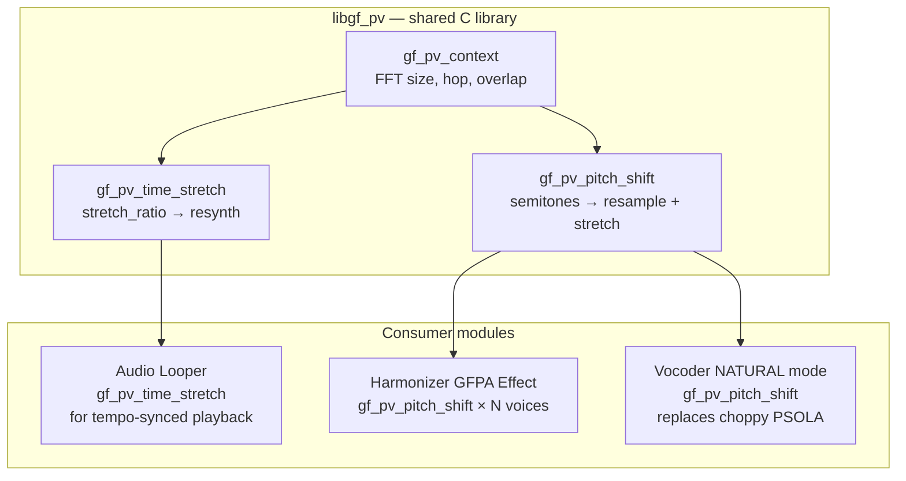
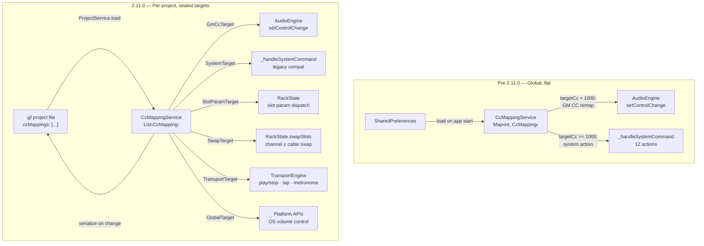

# GrooveForge Roadmap — Archive

Historical design notes and completed milestone sections moved here from
[ROADMAP.md](ROADMAP.md) to keep the active roadmap focused on pending work.
Each section was shipped in the version named in its header; implementation
details remain here for future reference.

---

## ✅ 2.12.7 — Phase Vocoder DSP Library

A shared, allocation-free C library for high-quality time-stretching and
pitch-shifting of arbitrary audio. Enables three downstream features: audio
looper tempo sync, real-time harmonizer effect, and a fix for the vocoder's
choppy NATURAL mode.

### Why a shared library

The pre-2.12.7 codebase had PSOLA in the vocoder (`audio_input.c`) for
monophonic voice pitch correction, but it produced choppy artifacts on the
NATURAL waveform and could not time-stretch. A proper **phase vocoder** (FFT
analysis → modify magnitudes/phases → IFFT resynthesis) handles:

- **Time-stretching** (change speed, preserve pitch) — needed for audio looper tempo sync
- **Pitch-shifting** (change pitch, preserve speed) — needed for the harmonizer
- **Both** on polyphonic audio (not just monophonic voice)

### Architecture



### Tasks

- [x] `native_audio/gf_phase_vocoder.h` — C API: `gf_pv_create`, `gf_pv_destroy`, `gf_pv_time_stretch`, `gf_pv_pitch_shift`, `gf_pv_process_block`.
- [x] `native_audio/gf_phase_vocoder.c` — FFT-based phase vocoder (STFT analysis, phase accumulation, overlap-add resynthesis). Pre-allocated FFT buffers (no RT allocation). Configurable FFT size (1024–4096), hop size, window function. Phase-locked (Laroche & Dolson 1999) for better transient preservation.
- [x] Audio looper integration: `dvh_alooper_process` PLAYING state uses the phase vocoder in stretch mode when BPM differs from `recordBpm`, producing tempo-synced playback without pitch change. Per-clip `gf_pv_context` allocated in `dvh_alooper_create`; fast path preserved when `|1 − recordBpm/bpm| < 0.005`. Wired into Linux, macOS, and Android.
- [x] Real `gf_pv_pitch_shift` implementation. Composes the existing time-stretch with an output-side resample stage: `internal_stretch = user_stretch × pitch_ratio` drives the FFT pipeline, then the drain stage reads the output ring at a fractional cursor advancing by `pitch_ratio` samples per output frame with linear interpolation. Net effect: `output_length = input_length × user_stretch` and every frequency is multiplied by `pitch_ratio`. The `pitch_ratio == 1` fast path bypasses the fractional drain entirely so existing time-stretch consumers stay bit-identical.
- [x] Smoke test — time-stretch: 4-bar 120→140 BPM loop. Duration error 0.72%, gain drift +1.3 dB, 440 Hz component preserved.
- [x] Smoke test — pitch shift: 440 Hz sine shifted ±12 semitones, DFT peak verified at 880 Hz / 220 Hz with > 500× margin over the 440 Hz residue.

### Remaining work (tracked in the main roadmap backlog)

- Session 2b — first-block ring-in latency compensation (~46 ms Hann+4x-overlap warm-up). Audible as a very slight fade-in over the first two beats after entering PLAYING on looper stretch, and as a dry-only first attack on the harmonizer. Options: pre-feed input samples before state transition, offset head start by the ring-in length, or accept as-is.
- Dart FFI bindings for standalone use.

---

## ✅ 2.12.7 — NATURAL vocoder mode — reality check (decision log)

The original plan in the Phase Vocoder milestone was "replace PSOLA in
`audio_input.c` with `gf_pv_pitch_shift` for smoother pitch correction". When
we actually mapped the code in session 3 planning, the premise turned out to
be wrong. Recording the reasoning here so we can revisit if the shipped
approach (option 1 below) ever disappoints.

**What NATURAL mode actually does.** It is *not* autotune-style pitch
correction of a live mic. It is a **captured-grain resynth**:

1. ACF detects the mic voice pitch every ~21 ms and captures a 2-period
   Hann-windowed voice grain. The grain carries the voice's timbre and
   formants.
2. A MIDI note defines the *target* frequency. The PSOLA engine retriggered
   the captured grain every `SR/targetHz` samples into an overlap-add
   buffer, synthesizing a sustained tone at the MIDI pitch.
3. The result passes through a 32-band vocoder filter bank modulated by the
   mic envelope.

So: mic = grain color, MIDI = pitch, filter bank = vocoder effect. A
granular/wavetable synth, not a pitch corrector.

**Why it sounded choppy.** The retrigger period is `SR/targetHz`. The grain
length is `2 × detectedPeriod = 2 × SR/detectedHz`. When
`targetHz < detectedHz`, the retrigger period exceeds the grain length and
there is audible **silence between grains**. When `targetHz > detectedHz`,
grains overlap and it smooths out. Users sing ~200 Hz and play ~110–220 Hz on
the controller, so the gap case dominated in practice.

**Why phase vocoder was the wrong tool.** A phase vocoder operates on a
streaming input and produces a pitch-shifted streaming output. NATURAL mode
needs the opposite: generate a **sustained** tone from a short captured
snippet, *long after the mic has gone silent*. There is no continuous input
to pitch-shift.

### Options considered

| # | Approach | LOC | Pros | Cons |
|---|---|---|---|---|
| 1 | **Large-grain looped resampling.** Capture mic samples on ACF convergence. Play the buffer back in a continuous loop at rate `targetHz/detectedHz` with linear interpolation. | ~40 | Simple. Zero FFT cost. No ring-in latency. No gap problem. Uses existing ACF pitch estimate. | Formants shift with extreme ratios. |
| 2 | **Phase vocoder driving a looped grain buffer.** Capture a long snippet. Feed it looped into the phase vocoder each callback. | ~150 | FFT-grade quality. Formant preservation. | Larger complexity. ~46 ms ring-in on every note-on — noticeable on a keyboard-driven instrument. |
| 3 | **Hybrid.** Keep PSOLA when `targetHz > detectedHz` (already smooth). Use option 1 when `targetHz < detectedHz`. | ~60 | Best worst-case quality. | Two code paths to maintain. No real advantage over option 1 in practice. |

### Decision: ship option 1 (2026-04-13)

The first attempt used a fixed 1024-sample loop plus a 64-sample
tail-to-head linear cross-fade. That was wrong on two counts: the cross-fade
introduced its own discontinuity at the wrap point, and the arbitrary loop
length produced an audible subharmonic modulation (~47 Hz) on top of the
fundamental.

The shipped version uses **integer-period looping without cross-fade**: the
capture length is `numPeriods × detectedLag`. For a periodic waveform,
sample N·P equals sample 0 by definition, so the seam is continuous by
construction. No cross-fade needed — any cross-fade would introduce a
discontinuity.

Captures that can't fit at least 2 full periods (very-low-pitch voices
≲ 95 Hz) are rejected so the renderer doesn't play a single-cycle buzz.
RMS-normalised to ~0.4 for consistent filter-bank carrier level.

### Fallback if option 1 ever disappoints

Option 2 remains viable. The phase vocoder library is in place with a real
`gf_pv_pitch_shift`; you would only need to wire the looped feed/drain
against the captured buffer, similar to the audio looper integration.
Expect ~46 ms ring-in per note-on as the known cost.

---

## ✅ 2.12.7 — Audio Harmonizer (GFPA Effect)

Real-time pitch-shifted harmony voices using the shared phase vocoder
library. Takes audio in, produces N parallel pitch-shifted copies at
configurable intervals (3rd, 5th, octave, etc.), mixed with the dry signal.

### Depends on

- Phase Vocoder DSP Library (above)
- GFPA effect plugin architecture

### Tasks

- [x] `com.grooveforge.audio_harmonizer` GFPA effect plugin — audio in → N pitch-shifted voices → audio out. (Registered under `audio_harmonizer` to avoid collision with the pre-existing `com.grooveforge.harmonizer` MIDI FX.)
- [x] Parameters: voice count (1–4), interval per voice (semitones, ±24), mix per voice, dry/wet.
- [x] `.gfpd` descriptor file with parameter layout.
- [x] Native DSP: `HarmonizerEffect` C++ class with 4 voices × 2 channels = 8 phase-vocoder contexts, all preallocated in the constructor. No audio-thread allocation.
- [x] l10n: EN/FR ARB keys.
- [x] Smoke test: play a melody through the harmonizer → verify clean parallel harmonies.

### Remaining work (tracked in the main roadmap backlog)

- Integration with Jam Mode: when scale-locked, snap harmony intervals to the active scale.

---

## ✅ 2.11.0 — Multi-USB Audio Device Routing (Android)

Android's default USB audio HAL binds to a single USB audio device per
direction (input/output). When a user plugs a USB hub with both a jack
output (for an amp/speakers) and a USB-C microphone, the system typically
only activates one of them. This is an Android audio policy limitation, not
a USB protocol issue.

### Background

- **Android ≤ 13**: the USB audio HAL selects one USB audio device per role; no app-level override.
- **Android 14+**: `AAudioStreamBuilder_setDeviceId()` allows targeting a specific `AudioDeviceInfo` by ID — but only if the HAL still enumerates the device. In practice, plugging a second USB audio device causes the HAL to deactivate the first, so `setDeviceId()` cannot reach it.
- **Combined audio routing** (Android 12+ / extended in 14): `setPreferredDevicesForStrategy()` supports multi-device routing but is a **privileged/system API** — unavailable to regular apps. Even with it, Android 14 only allows simultaneous routing for USB devices of **different audio types**, and requires kernel + vendor support.
- **OEM variability**: device enumeration through a USB hub is inconsistent across manufacturers. Samsung (tested) deactivates the second USB audio device entirely at the HAL level — it disappears from `AudioManager.getDevices()`.

### Reliable alternatives

| Approach | Reliability | Notes |
|---|---|---|
| USB composite audio device (single USB device exposing both input + output interfaces) | ✅ High | HAL sees one device; best option if user hardware supports it |
| Built-in mic + USB jack output | ✅ High | Android handles mixed built-in + USB routing well |
| Two separate USB devices on a hub + `setDeviceId()` | ⚠️ Variable | Works on some OEMs (Android 14+), fails on others |

### OEM compatibility matrix (2026-04-06)

> **Test device**: Samsung Galaxy Z Fold 6 (SM-F956B), Android 15, One UI 7
> **USB dock**: generic USB-C dock with 3.5 mm jack output (chip: CS202)
> **USB mic**: BOYA Mini 2 (USB-C, input only)

| Scenario | Devices enumerated | Result |
|---|---|---|
| BOYA mic only (USB-C) | BOYA Mini 2 (id=302, card=2, input) | ✅ Works |
| Dock + headset only (jack) | CS202 (id=293, card=3, output) + CS202 (id=298, card=3, input) | ✅ Works — composite device, both I/O on same chip |
| BOYA mic + dock headset (both plugged simultaneously) | CS202 only — **BOYA disappears from enumeration** | ❌ **Android HAL drops the BOYA entirely** |
| Built-in mic + dock headset | Built-in mic + CS202 (output) | ✅ Works — mixed built-in + USB routing |

**Conclusion**: Android's USB audio HAL on Samsung (and likely most OEMs)
only activates **one USB audio device** at a time. When the dock's CS202
chip activates, the BOYA is deactivated at the HAL level — it is not just
deprioritized, it is **removed from `AudioManager.getDevices()` entirely**.
`setDeviceId()` is therefore useless for the two-separate-USB-devices
scenario.

### Revised scope: single-device routing + built-in mic fallback

Given the HAL limitation, the multi-USB feature pivoted to:
1. **Letting the user choose which USB device to use** when multiple are available (before one gets deactivated).
2. **Built-in mic + USB output** as the reliable multi-device path.
3. **Synth output device routing** via `setDeviceId()` on the AAudio stream.

All items shipped.

---

## ✅ 2.11.0 — Per-Project CC Mappings

GrooveForge's original CC mapping system was limited: ~12 system actions,
standard GM CC remapping, and global storage in SharedPreferences. This
milestone transformed CC mappings into a comprehensive, per-project,
slot-addressed control surface.

### Why this matters

- **Live performance**: a guitarist's pedalboard CC layout for a blues set is different from a synth-heavy electronic set. Switching projects should switch the entire CC map.
- **Collaboration**: sharing a `.gf` file includes the hardware mapping, so a collaborator with the same controller model gets the same experience.
- **Deep module control**: bypass effects on the fly, sweep a wah center frequency, cycle arpeggiator patterns, change vocoder waveforms — all from hardware CC without touching the screen.
- **Channel-swap macro**: one CC press swaps two instruments' MIDI channels (and optionally their entire signal chains), enabling instant live instrument switching.
- **System integration**: control transport (play/stop, tap tempo, metronome) and OS media volume directly from hardware.

### Architecture



### Data model — sealed `CcMappingTarget` hierarchy

The original `CcMapping.targetCc` field was overloaded (GM CCs 0-127, system
actions 1001+). The new model uses a sealed class hierarchy with six target
types:

```dart
class CcMapping {
  final int incomingCc;           // Hardware CC 0-127
  final CcMappingTarget target;   // Sealed — one of six types
}

sealed class CcMappingTarget { toJson(); fromJson(); }

class GmCcTarget       { targetCc, targetChannel }           // Standard GM remap
class SystemTarget     { actionCode, targetChannel, muteChannels? } // Legacy 1001-1014
class SlotParamTarget  { slotId, paramKey, mode }             // Slot-addressed param
class SwapTarget       { slotIdA, slotIdB, swapCables }       // Channel-swap macro
class TransportTarget  { action: playStop|tapTempo|metronomeToggle }
class GlobalTarget     { action: systemVolume }               // OS-level controls
```

**Multiple mappings per CC**: one hardware knob can control multiple targets
(e.g. CC 20 → reverb mix + delay mix). Storage changed from
`Map<int, CcMapping>` to `List<CcMapping>` with a pre-built
`Map<int, List<CcMapping>>` index.

#### `.gf` JSON schema

```json
{
  "ccMappings": [
    { "cc": 20, "target": { "type": "slotParam", "slotId": "slot-3", "paramKey": "mix", "mode": "absolute" } },
    { "cc": 64, "target": { "type": "slotParam", "slotId": "slot-3", "paramKey": "bypass", "mode": "toggle" } },
    { "cc": 30, "target": { "type": "swap", "slotIdA": "slot-0", "slotIdB": "slot-1", "swapCables": true } },
    { "cc": 31, "target": { "type": "transport", "action": "playStop" } },
    { "cc": 7,  "target": { "type": "global", "action": "systemVolume" } }
  ]
}
```

### Curated parameter registry

Static Dart registry (`CcParamRegistry`) — not embedded in `.gfpd`
descriptors. Declares which parameters per plugin type are CC-controllable.

| Plugin type | paramKey | GFPA paramId | Mode | Notes |
|---|---|---|---|---|
| **All audio effects** | `bypass` | — | toggle | `state['__bypass']` |
| **Reverb** | `mix` | 3 | absolute | |
| **Delay** | `mix` | 4 | absolute | |
| **Delay** | `time` | 0 | absolute | |
| **Delay** | `bpm_sync` | 2 | toggle | |
| **Compressor** | `threshold` | 0 | absolute | |
| **Chorus** | `mix` | 6 | absolute | |
| **Chorus** | `rate` | 0 | absolute | |
| **Wah** | `center` | 0 | absolute | |
| **Wah** | `depth` | 3 | absolute | |
| **All MIDI FX** | `bypass` | — | toggle | `state['__bypass']` |
| **Arpeggiator** | `pattern` | 0 | cycle | 6 options |
| **Arpeggiator** | `division` | 1 | cycle | 9 options |
| **Chord Expand** | `chord_type` | 0 | cycle | 11 options |
| **Transposer** | `semitones` | 0 | absolute | |
| **Velocity Curve** | `amount` | 1 | absolute | |
| **Jam Mode** | `scale_type` | 0 | cycle | 14 options |
| **Jam Mode** | `detection_mode` | 1 | cycle | 2 options |
| **GF Keyboard** | `next_patch` | — | cycle | `_changePatchIndex` |
| **GF Keyboard** | `prev_patch` | — | cycle | |
| **GF Keyboard** | `next_soundfont` | — | cycle | `_cycleChannelSoundfont` |
| **GF Keyboard** | `prev_soundfont` | — | cycle | |
| **Vocoder** | `waveform` | 0 | cycle | 4 (saw/square/choral/neutral) |
| **Vocoder** | `noise_mix` | — | absolute | `vocoderNoiseMix` notifier |

### Channel-swap algorithm

`RackState.swapSlots(String slotIdA, String slotIdB, {bool swapCables = true})`:

**Always** (channels-only):
1. Validate both slots exist and are instrument-type (`midiChannel > 0`)
2. Swap MIDI channels: `pluginA.midiChannel ↔ pluginB.midiChannel`
3. Re-apply `_applyPluginToEngine()` for both (re-routes FluidSynth)
4. Re-sync `_syncJamFollowerMapToEngine()` (Jam entries reference channels)
5. Re-sync `VstHostService.syncAudioRouting()`

**Additionally when `swapCables == true`:**
6. Rewire `AudioGraph`: `swapSlotReferences(slotIdA, slotIdB)` — bulk rewrite all connections
7. Swap Jam Mode slot references (`masterSlotId`, `targetSlotIds`)
8. Update CC mappings: any `SlotParamTarget` referencing either slot gets swapped

### System volume control

| Platform | API | Notes |
|---|---|---|
| Android | `AudioManager.setStreamVolume(STREAM_MUSIC, …)` | Method channel in `MainActivity.kt` |
| Linux | `pactl set-sink-volume @DEFAULT_SINK@ X%` | `Process.run` |
| macOS | `osascript -e "set volume output volume X"` | `Process.run` |
| iOS | Not possible (Apple restriction) | Toast explaining limitation |
| Web | `AudioContext.destination.gain` | App audio only |

### CC preferences UI — hierarchical target picker

```
[Category]          → [Slot]              → [Parameter]
├─ Standard GM CC   → (channel picker)     → CC number
├─ Instruments      → GF Keyboard 1        → Next Patch / Prev Patch / Next SF / …
│                   → Vocoder              → Waveform / Noise Mix
├─ Audio Effects    → Reverb (slot-3)      → Bypass / Mix
│                   → Delay (slot-4)       → Bypass / Mix / Time / BPM Sync
├─ MIDI FX          → Arpeggiator (slot-5) → Bypass / Pattern / Division
│                   → Jam Mode (slot-6)    → Bypass / Scale Type / Detection
├─ Looper           → (existing actions)
├─ Transport        → Play/Stop / Tap Tempo / Metronome Toggle
├─ Global           → System Volume
└─ Macros           → Swap: [slot A] ↔ [slot B] (checkbox: swap cables?)
```

All phases delivered across Foundation, Audio effect bypass, Registry,
UI overhaul, Channel-swap macro, l10n, and testing.
